# FigDown

> **Figures as text — one source, two readers.**

繁體中文版：[README.zh-tw.md](README.zh-tw.md)

FigDown is an (early, in-design) open standard for describing figures as
plain text inside Markdown — so that the *same* source is:

- **read as text by AI agents** — the knowledge in your diagrams stops
  being locked inside bitmaps, and
- **rendered as figures for humans** — deterministically converted to SVG
  that travels with the document, viewable in any Markdown viewer.

Think "the figure layer of Markdown": what Mermaid did for flowcharts,
extended to the diagram types Mermaid can't express (network topologies,
annotated block diagrams, lookup chains, packet walks…), with layout
treated as part of the knowledge.

## See it

This figure *is* FigDown — the text below is its complete source:

```figdown
figdown 0.1 block
title "One source, two readers"

node src  "ingress.fd\n(source of truth)"  shape=rounded  color=#e0e7ff
node rend "FigDown renderer\n(build-svg.js)"
node svg  "ingress.svg\n(artifact)"        shape=rounded  color=#dcfce7
node human "human reader"                  shape=ellipse
node agent "AI agent"                      shape=ellipse   color=#fef9c3

flow right
rank svg human

edge src  -[deterministic build]->  rend
edge rend -[stable SVG]->           svg
edge svg  -[reads visually]->       human
edge src  -[reads for meaning]->    agent
```



<sub>source: [figures/one-source-two-readers.fd](figures/one-source-two-readers.fd)</sub>

## Why

Technical documents are full of figures whose *layout carries meaning* —
rank, zones, direction, adjacency. Today that knowledge is trapped in
images: AI agents can't reliably read it, and hand-maintained diagrams
drift from the text around them. Existing text-to-diagram tools cover only
part of the problem and none of them promise the property we consider
essential: **a small edit to the source must produce a small change in the
figure** — never a full re-layout that destroys the reader's mental map.

## Design axioms (settled so far)

1. **Text is the single source of truth.** Figures are build artifacts,
   100% generated from text. No dual maintenance, ever.
2. **Deterministic, program-only rendering.** Same source → same SVG,
   bit-level; no LLM in the rendering path.
3. **Layout stability.** Local edit → local change. Explicitly declared
   attributes (position, size, color…) are rigid; everything undeclared
   adapts automatically with minimal spillover.
4. **Two audiences, one artifact.** AI reads the fenced source block;
   humans see the embedded SVG. The standard defines how the two stay
   paired and in sync.
5. **Defaults = the common case.** Most figures should need no
   supplementary declarations at all (convention over configuration).
6. **Small, closed, token-lean core.** Every line starts with a known
   keyword; unknown lines are errors with line numbers (this powers the
   AI write→validate→fix loop). Teaching the language to an AI agent must
   fit in a lean prompt. Generic rules over special cases; survey existing
   standards before inventing anything.
7. **An editor is mandatory, but every GUI action is a text edit** —
   dragging a node writes a position declaration. The GUI never owns state
   that the text can't express.
8. **Static first; dynamic later.** Dynamic = static + a discrete
   page/step sequence (for algorithm/protocol walkthroughs), not a
   timeline animation language.

## Recommended usage in Markdown documents (current stage)

Until `.fd` is natively rendered by Markdown viewers (as mermaid is),
embed figures like this:

```markdown


<sub>source: [figures/ingress.fd](figures/ingress.fd)</sub>
```

The SVG is what humans see; the `source:` footer points at the `.fd`,
which is the figure's single source of truth — **AI agents read the
`.fd` for the meaning** and never paste its content into the `.md`.
Each generated SVG also embeds its own source + SHA-256, so the figure
file alone can always be reopened and edited. See
[AGENT-GUIDE.md](AGENT-GUIDE.md) for the full agent-facing workflow.

## Status

**Requirements & design phase.** Nothing to install yet. Current documents:

- [requirements-notes.md](design/requirements-notes.md) — the requirements log
  (R0–R15) and decisions (D1–D3), also in
  [繁體中文](design/requirements-notes.zh-tw.md)
- [syntax-draft.md](spec/syntax-draft.md) — syntax draft v0.0 (discussion
  stage), also in [繁體中文](spec/syntax-draft.zh-tw.md)
- [AGENT-GUIDE.md](AGENT-GUIDE.md) — the self-contained guide for AI
  agents maintaining figures with FigDown, also in
  [繁體中文](AGENT-GUIDE.zh-tw.md)
- [MIGRATIONS.md](spec/MIGRATIONS.md) — schema-migration-style version log:
  every syntax change ships a mechanical rewrite rule, also in
  [繁體中文](spec/MIGRATIONS.zh-tw.md)
- [census.md](design/census.md) — figure-type census over a real 774-document
  corpus; the empirical basis for v0.1 scope and priorities, also in
  [繁體中文](design/census.zh-tw.md)
- [prior-art.md](design/prior-art.md) — informative survey of mainstream
  diagram-language conventions (edge labels, ERD, D2 relationship),
  weighted by adoption, also in [繁體中文](design/prior-art.zh-tw.md)
- [examples/index.md](examples/index.md) — the example gallery: real
  figures as committed `.fd`+`.svg` pairs (protocol headers first)
- [editor/figdown.html](editor/figdown.html) — the editor: open in any
  browser, edit text on the left, get a deterministic SVG on the right
  (core scene + bitfield + table + wave). Opens/saves `.fd` files
  (Ctrl+S writes back to the same file), undo/redo, autosave,
  draw.io-style direct manipulation where every GUI action is a text
  edit. The exported SVG embeds its own source and SHA-256.
- [skill/README.md](skill/README.md) — installable agent skill: teach
  a coding agent (e.g. Claude Code) to maintain figures with FigDown —
  `cp -r skill/figdown ~/.claude/skills/` and ask for a figure.

## Contributing

Ideas, counter-examples, and prior-art pointers are very welcome — please
open an issue. The most valuable contributions right now:

- diagram types we must cover (with real samples),
- existing standards/conventions we should borrow instead of invent,
- attacks on the axioms above (tell us where they break).
