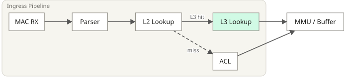

# FigDown

> **Figures as text in Markdown — one source, two readers.**

FigDown is an open standard for describing figures as plain text inside
Markdown, so that **one** source serves two readers who need completely
different things from it:

- **AI agents read the `.fd` for meaning.** The knowledge in your diagrams —
  participants, relationships, containment, field widths, table structure —
  stops being locked inside a bitmap. An agent answers questions from the
  text, and never has to OCR a picture.
- **Humans see a deterministic SVG.** The same source is converted to SVG by
  a plain program — no model in the rendering path — and the artifact travels
  with the document, viewable in any Markdown viewer.

Think of it as the figure layer of Markdown: what Mermaid did for flowcharts,
extended to the diagram families Mermaid cannot express — annotated block
architectures, protocol headers, lookup tables, packet walks — with **layout
treated as part of the knowledge** rather than as something the renderer is
free to rearrange.

**[Try it live — the editor runs in your browser, no install.](https://figdown.github.io/figdown/)**

---

## Fifteen seconds

This is a complete FigDown document. Nothing has been elided.

```figdown
figdown 0.1 block
title "Ingress datapath (excerpt)"
group ing "Ingress Pipeline"
node mac "MAC RX" in=ing
node parser "Parser" in=ing
node l2 "L2 Lookup" in=ing
node l3 "L3 Lookup" in=ing fill=#d1fae5
node acl "ACL" in=ing
node mmu "MMU / Buffer"
flow right
edge mac -> parser
edge parser -> l2
edge l2 -[L3 hit]-> l3
edge l2 -[miss]-> acl style=dashed
edge l3 -> mmu
edge acl -> mmu
```

It renders to this, deterministically — same source, same bytes, every time:



<sub>source: [figures/ingress.fd](figures/ingress.fd) — this figure is FigDown</sub>

An agent handed the text above can say which stages are inside the ingress
pipeline, that an L2 miss goes to the ACL stage, and that both branches
converge on the MMU. It can say all of it without seeing the picture. That is
the whole idea.

In a Markdown document you embed the artifact and point at the source:

```markdown


<sub>source: [figures/ingress.fd](figures/ingress.fd)</sub>
```

The SVG is what humans see; the `source:` footer is what agents follow. Each
generated SVG also embeds its own source text and a SHA-256 of it, so a figure
that gets separated from its `.fd` can always be recovered and reopened.

---

## Why

Technical documents are full of figures whose **layout carries meaning** —
rank, zones, direction, adjacency. Today that knowledge is trapped in images:
AI agents cannot reliably read it, and hand-maintained diagrams drift from the
text around them.

Existing text-to-diagram tools cover only part of the problem, and none of them
promise the property we consider essential:

> **A small edit to the source must produce a small change in the figure** —
> never a full re-layout that destroys the reader's mental map.

That sentence is the project's reason to exist. A diagram language that
re-flows the whole picture when you rename one node is not a maintenance tool;
it is a generator you run once and then stop touching, which is exactly how
figures come to disagree with the prose beside them.

## Design axioms

These are the beliefs the language is built on. Every ruling in
[`decisions/`](decisions/README.md) traces back to one of them, and they are
listed here rather than buried because a reader who has only the rules cannot
tell a principled decision from an arbitrary one.

1. **Text is the single source of truth.** Figures are build artifacts, 100%
   generated from text. No dual maintenance, ever.
2. **Deterministic, program-only rendering.** Same source → same SVG, at the
   byte level; **no model in the rendering path**.
3. **Layout stability.** Local edit → local change. Explicitly declared
   attributes (position, extent, colour…) are rigid; everything undeclared
   adapts automatically, with spillover kept minimal.
4. **Two audiences, one artifact.** An AI agent reads the source block; humans
   see the embedded SVG. The standard defines how the two stay paired and in
   sync.
5. **Defaults are the common case.** Most figures should need no supplementary
   declarations at all — convention over configuration.
6. **A small, closed, token-lean core.** Every line starts with a known
   keyword; unknown lines are errors carrying a line number, which is what
   powers the AI write → validate → fix loop. Teaching the language to an agent
   must fit in a lean prompt. Generic rules over special cases; survey existing
   standards before inventing anything.
7. **An editor is mandatory, but every GUI action is a text edit.** Dragging a
   node writes a position declaration. The GUI never owns state that the text
   cannot express.
8. **Static first; dynamic later.** Dynamic means static plus a discrete
   page/step sequence, for algorithm and protocol walkthroughs — not a timeline
   animation language.

## Stability — read this before adopting

**FigDown 0.x is a preview, and it is NOT stable.** The language may change
between 0.x versions in ways that require a document to be rewritten. No 0.x
version carries a stability promise, and none should be read as carrying one.

This is stated plainly because the opposite mistake is expensive and quiet: the
project's visible care — a migration log, a conformance suite, the word
*frozen* — invites a reader to infer a stability promise that was never made.

> **"Frozen" is not "stable".**
>
> *Frozen* names the **scope of the change-management promise**, not the
> absence of change. A frozen construct **may still change**. What frozen
> guarantees is *how* it may change: in the same release, the change must ship
> an entry in [`spec/migrations.md`](spec/migrations.md) carrying a
> **mechanical rewrite rule**, a **named diagnostic** so that documents written
> against the old spelling fail loudly instead of silently changing meaning,
> and the matching rewrite in the migration tool.
>
> Anything marked **experimental** may change or be withdrawn with none of
> those three.

So "frozen" is a real guarantee — about *process*, not about *permanence*.

### Two version numbers, and how they are bound

FigDown carries **two** version numbers. Confusing them makes the central
promise unstatable, because "you may stay on a version" has to say *which*
version or it means nothing.

| number | what it versions | where it is written |
|---|---|---|
| **`figdown X.Y`** | the **language** — the document format | the `figdown` header line of every `.fd` file |
| **`vX.Y.Z`** | the **release** — this repository and its engine | the git tag, `package.json`, and every artifact's `data-engine-version` |

**They are bound: `figdown X.Y` is the first two parts of the release version.**
Release `v0.3.2` implements language `figdown 0.3`. The language number has no
third part and never will — a `Z` bump is by definition a change the language
did not make.

| part | meaning |
|---|---|
| **`Z`** | **Bug fixes only.** The language does not move. `v0.1.1` may fix a rendering defect with **no `.fd` file altered**. |
| **`Y`** | **Features are added. Nothing is ever removed.** Every document a `Y` release accepted, the next one still accepts. |
| **`X`** | **The only point at which support may be removed** — and removing it forces a migration. |

`X` carries the whole removal budget. That is the strict part, and it has a
sharp consequence: **a rename is a removal.** After `v1.0.0` a frozen construct
cannot be renamed within `figdown 1.y` — a rename takes `figdown 2.0`. The
industry-standard deprecate-then-remove cycle is deliberately refused, because
**code is maintained but documents are archived**: a deprecation warning assumes
an author who comes back and runs the thing, and a five-year-old figure has no
such author.

### Three promises, not one

One word — "version" — usually carries all three of these. They are distinct,
and each is worth something on its own:

| promise | what it says | condition |
|---|---|---|
| **Compatible** | the document's **meaning** is preserved; the engine accepts it and renders it correctly | same `X`, engine `Y` ≥ document `y` — **from `v1.0.0` only** |
| **Reproducible** | the **bytes** of the SVG are identical | same source **and** same release version — holds today |
| **Available** | the **archived engine still runs**, so the exact figure is always recoverable | unconditional, from the first release onward |

Two limits are worth stating plainly, because assuming them away is what makes
the archive look redundant when it is not:

- **Compatibility takes force at `v1.0.0`.** During 0.x there is no such
  guarantee, and **`figdown 0.1` → `figdown 0.2` is not covered**. The rule is
  written now so that it is rehearsed now.
- **Compatible is not byte-identical.** A `Y` bump may legitimately improve
  rendering while removing nothing: the meaning is unchanged, the picture may
  not be. To recover the exact figure you need the exact engine — which is
  precisely why the per-release archive exists.

### What is promised

|  | **0.x (today)** | **v1.0 and later** |
|---|---|---|
| Mechanical migration between language versions | **SHOULD** — best effort | **MUST** |
| A document staying on an older declared language version | **MAY** — permitted, not promised | **MUST** be honoured; a rewrite is never forced |
| The archived engine for a release remaining runnable | **MUST** | **MUST** |

The middle row is the compatibility promise above; the bottom row is
availability, and it is the one that does not weaken in 0.x.

Two consequences worth planning around:

- **The archive is the promise that does not weaken.** Every release gets one
  tag and one immutable, self-contained engine page. A user who wants to stay
  on a language version always can, by running the release that implemented it
  — and that does not depend on any future engine still understanding old
  documents.
- **Expect one migration at `figdown 1.0`, and none after it** — until a
  `figdown 2.0`, which is the only place a removal may occur and which arrives
  with its own migration.

**Stability begins at v1.0.** The full normative policy is
[`spec/core.md` §13](spec/core.md#13-stability-and-versioning-normative).

---

## Where to go next

Every document below has exactly one reader. Find yourself in the left column
and read that row; you should not need the others.

| If you are… | Read |
|---|---|
| **authoring a figure** | [`guide/authoring.md`](guide/authoring.md) — state the meaning, pick a genre, express it, and know when to stop |
| **an AI agent or a tool reading `.fd`** | [`guide/agents.md`](guide/agents.md), then the reading-agent contract in [`spec/core.md` §12.7](spec/core.md#127-the-reading-agent-contract) — what you may conclude from a document, and what you must not |
| **handed a `.fd` and needing to read it correctly** | [`read/0.1/reading.md`](read/0.1/reading.md) — nothing to install: that file plus the one for the genre on line 1 ([`bitfield.md`](read/0.1/bitfield.md), [`scene.md`](read/0.1/scene.md) for `block`, `topology` and `flowchart`, [`table.md`](read/0.1/table.md), [`layout.md`](read/0.1/layout.md) for arrangement, [`transcribe.md`](read/0.1/transcribe.md) to go the other way). Reading a `bitfield` costs those two files, ~13 KB, against ~335 KB of specification. `0.1` is the language version they describe; a later `read/0.2/` is added beside them and `read/0.1/` does not change. |
| **implementing FigDown** | [`spec/core.md`](spec/core.md) for the normative language, then [`conformance/`](conformance/README.md) — golden fixtures designed to be passed without ever reading the reference engine |
| **evaluating whether to adopt it** | [`guide/showcase.md`](guide/showcase.md) — worked figures, each with its source, what a human sees, what an agent can answer from the text alone, and what the figure still cannot say |

Secondary routes, once you are past the first read:

| | |
|---|---|
| [`guide/expressing.md`](guide/expressing.md) | stuck on one thing mid-document: "I need to show X → use Y", plus what the current language cannot express and the sanctioned interim for each |
| [`guide/layout.md`](guide/layout.md) | the figure parses but does not read well: the escalation ladder and when to stop climbing it |
| [`spec/README.md`](spec/README.md) | what is frozen, what is experimental, and what each promises |
| [`decisions/`](decisions/README.md) | why the language is shaped this way, what was rejected, and what would reopen it |
| [`examples/`](examples/index.md) | specimens to copy — real `.fd` + `.svg` pairs |
| [`skill/`](skill/README.md) | installing FigDown into a coding agent |
| [`tools/`](tools/README.md) | building and checking figures from a command line or in CI |
| [`dist/`](dist/README.md) | embedding the renderer in your own program |
| [`integrations/`](integrations/) | wiring FigDown into a documentation pipeline |

## Install

The renderer is published on npm under the MIT licence:

```sh
npm install -g figdown
figdown-svg your.fd
```

No network access and no other dependency is needed to render. The browser
editor is a single self-contained HTML file; the CLI needs only Node.js.

## Contributing

Proposals, counter-examples and prior-art pointers are welcome. The registry is
closed by design, so a change arrives fastest when it brings evidence — see
[`.github/CONTRIBUTING.md`](.github/CONTRIBUTING.md) for what a proposal must
carry and how a frozen construct differs from an experimental one.

The most valuable contributions right now are diagram types the standard must
cover (with real samples), existing conventions it should borrow instead of
invent, and attacks on the axioms above — tell us where they break.

Security reports go through [`.github/SECURITY.md`](.github/SECURITY.md), never
a public issue.

## Licence

MIT — see [LICENSE](LICENSE).
