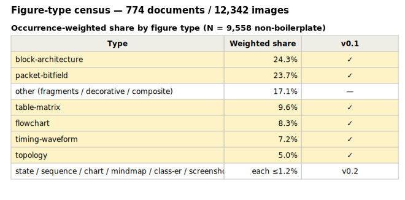

# Figure-Type Census — real-world corpus (2026-07-02)

> Basis for FigDown's first-version scope (R12: highest-volume content
> first) and defaults (R13: defaults = the common case).
>
> 繁體中文版：[census.zh-tw.md](census.zh-tw.md)

## Corpus & method

- Source: a private corpus of **774 internal hardware design documents**
  (network-switch domain, .docx). Document contents are not published;
  only aggregate statistics appear here.
- Extraction: all embedded images pulled from the docx containers —
  **12,342 images** (53% EMF vector, 45% PNG, 2% WMF/JPEG).
- Deduplication by MD5 → **2,177 unique images** (82% of occurrences are
  repeats: shared templates, figures reused across documents).
- Classification: every unique image was viewed and classified by an AI
  vision pass into a taxonomy formed from the **union of figure types
  supported by Mermaid, PlantUML, D2, Graphviz and WaveDrom**, plus
  non-diagram buckets (screenshot/photo/other). Coverage: **2,177/2,177 (100%)**.
  A human review pass over the classified folders is the planned next
  refinement.

## Results

source: [figures/census-summary.fd](figures/census-summary.fd) — this figure is FigDown

**Unique images (2,177 classified):**

| Type | Count | Share |
|---|---:|---:|
| block-architecture | 702 | 32.2% |
| packet-bitfield | 394 | 18.1% |
| other (fragments/decorative/composite) | 334 | 15.3% |
| flowchart | 219 | 10.1% |
| table-matrix | 212 | 9.7% |
| timing-waveform | 142 | 6.5% |
| topology | 95 | 4.4% |
| state | 25 | 1.1% |
| chart | 21 | 1.0% |
| sequence | 14 | 0.6% |
| screenshot | 12 | 0.6% |
| mindmap-tree | 6 | 0.3% |
| class-er | 1 | 0.05% |

**Occurrence-weighted** (each unique multiplied by how often it appears
across the corpus; the 3 boilerplate template graphics that alone account
for 2,784 occurrences are excluded; N = 9,558):

| Type | Share |
|---|---:|
| block-architecture | 24.3% |
| packet-bitfield | 23.7% |
| other | 17.1% |
| table-matrix | 9.6% |
| flowchart | 8.3% |
| timing-waveform | 7.2% |
| topology | 5.0% |
| state / sequence / chart / mindmap / class-er / screenshot | each ≤1.2% |

## Conclusions for FigDown

1. **The v0.1 scope is confirmed and quantified.** Core scene
   (block-architecture + topology + flowchart, one box-and-wire model)
   = 37.6% weighted; adding the three typed blocks — `bitfield` (23.7%),
   `table` (9.6%), `wave` (7.2%) — brings coverage to **78% of all
   non-boilerplate figure occurrences, ≈95% of classifiable diagrams**.
2. **Priority order** (weighted): core scene → bitfield → table → wave.
   The two giants are block-architecture and packet-bitfield, together
   ~48% — both types Mermaid handles poorly or not at all.
3. **The Mermaid-coverage assumption is revised.** Types Mermaid renders
   natively and stably (flowchart, sequence, state, class-ER, charts,
   mindmap) sum to **~12%** of this corpus — far below the initial
   "about half" estimate (R0). In hardware documentation, the gap
   FigDown targets is the overwhelming majority, not the leftover.
4. **Vector originals dominate** (53% EMF): most figures were *drawn*,
   not photographed or captured — i.e. they were born as structure and
   lost it in the container. A text format is recovering something that
   existed, not inventing something new. (EMF parsing as a future
   migration aid is an open idea.)
5. `other` (15.3% of uniques) is mostly fragments of composite figures,
   decorative elements and unreadable stubs; the manual review pass will
   reallocate part of it.
