# FigDown Example Gallery

> Every figure below is an SVG generated deterministically from the
> `.fd` text file next to it (`node tools/build-svg.js examples/`).
> Each SVG embeds its own source and a SHA-256 of it — open one in a
> text editor to see the "one source, two readers" idea in action.
>
> 繁體中文版：[index.zh-tw.md](index.zh-tw.md)

## Flagship: topology + supplementary knowledge

### VXLAN/EVPN Leaf-Spine Fabric  — [source](evpn-fabric.fd)
One source file: the topology (with a VXLAN-tunnel overlay layer) plus
the VNI mapping and fabric-plane tables that real design docs put next
to it.

### EVPN-VXLAN IRB — vendor-style leaves with VRF/BD detail  — [source](srl-evpn-irb.fd)
Semantic recreation of a vendor doc figure: fabric cloud, leaf boxes
holding IP-VRF badges and dashed bridge domains, port labels on links,
multi-line host captions. Fully hand-pinned (tier-3 layout).

### VXLAN encapsulation — before/after frames  — [source](vxlan-encap.fd)
Classical frame vs. VXLAN frame (original L2 frame nested), the
VLAN-to-VNI arrow, and overhead/fact tables.

## Protocol headers (bitfield template)

### Ethernet II (+ optional 802.1Q)  — [source](ethernet-ii.fd)

### IPv4 — RFC 791  — [source](ipv4.fd)

### TCP — RFC 9293  — [source](tcp.fd)

### UDP — RFC 768  — [source](udp.fd)

### VXLAN — RFC 7348  — [source](vxlan.fd)

### Buffer partition — shared pool + reservations  — [source](buffer-partition.fd)
The `partition` template: columns + threshold lines; zones derive from
the lines (`fill=below`). Seven lines of text, zero coordinates.

### Queue-occupancy heatmap  — [source](queue-heatmap.fd)
A data matrix as a table with per-cell marks — the readable 2-D answer
to 3-D bar charts.

## Just for fun

### Rainbow rings — [source](rainbow.fd)
No `layer` directives at all: line order is the layer. Seven concentric
`cloud` nodes; later lines paint on top.

---

More waves per the [gallery plan](../gallery-plan.md): the full header
set (E1), protocol negotiation sequences (E2), algorithm & data-structure
figures (E3), and math-annotated figures (E4).
