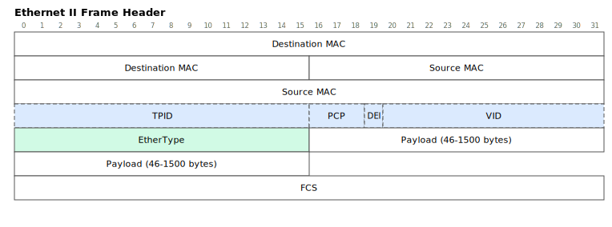
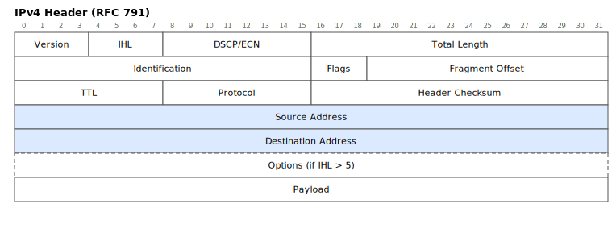
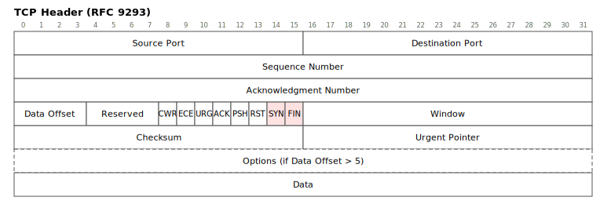
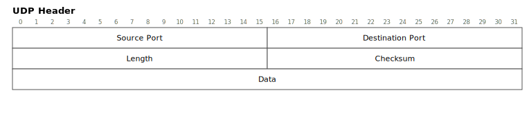
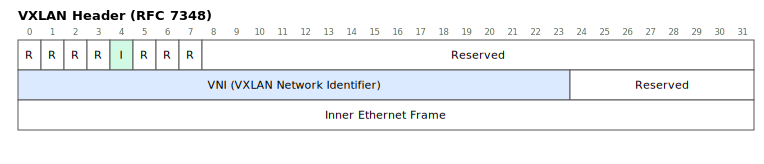

# FigDown Example Gallery

> Every figure below is an SVG generated deterministically from the
> `.fd` text file next to it (`node tools/build-svg.js examples/`).
> Each SVG embeds its own source and a SHA-256 of it — open one in a
> text editor to see the "one source, two readers" idea in action.
>
> 繁體中文版：[index.zh-tw.md](index.zh-tw.md)

## Flagship: topology + supplementary knowledge

### VXLAN/EVPN Leaf-Spine Fabric  — [source](evpn-fabric.fd)
One source file: the topology (with a VXLAN-tunnel overlay layer) plus
the VNI mapping and fabric-plane tables that real design docs put next
to it.

## Protocol headers (bitfield template)

### Ethernet II (+ optional 802.1Q)  — [source](ethernet-ii.fd)

### IPv4 — RFC 791  — [source](ipv4.fd)

### TCP — RFC 9293  — [source](tcp.fd)

### UDP — RFC 768  — [source](udp.fd)

### VXLAN — RFC 7348  — [source](vxlan.fd)

---

More waves per the [gallery plan](../gallery-plan.md): the full header
set (E1), protocol negotiation sequences (E2), algorithm & data-structure
figures (E3), and math-annotated figures (E4).
