# FigDown Example Gallery

> Every figure below is an SVG generated deterministically from the
> `.fd` text file next to it (`node tools/build-svg.js examples/`).
> Each SVG embeds its own source and a SHA-256 of it — open one in a
> text editor to see the "one source, two readers" idea in action.
>
> Sections mirror the genre families, ordered by their share in the
> figure-type census (census.md).
>
>
> See also the [structure pattern library](patterns/index.md) — generic
> skeletons distilled from a real 774-document corpus.

## Statecharts (`statechart` — EXPERIMENTAL genre, requires `figdown 0.2`)

Classic FSMs in the **`statechart` genre**: `state`/`transition` spell the
roles, short labels, `#` multi-line notes, optional companion table. This
section's header once read "planned genre; portable `block` today" — the
genre registered and every figure here declares it, so that
sentence had been false for two releases and is corrected rather than
kept. See [statechart/index.md](statechart/index.md).

## Block & architecture (census #1)

### VXLAN encapsulation — before/after frames  — [source](vxlan-encap.fd)
Classical frame vs. VXLAN frame as single-row tables whose cell order is
the on-the-wire order (original L2 frame nested under a header span), with
the VLAN-to-VNI relation as a shared `class` plus overhead/fact tables.
Zero layout lines — see [guide/layout.md §7](../guide/layout.md#7-before--after-the-same-semantics-different-layout-zones).

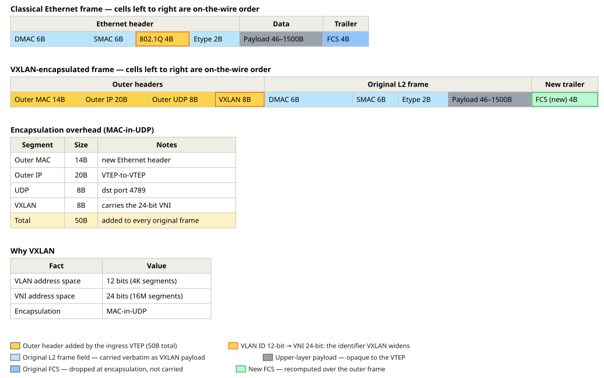

### Telemetry export path — the one-document hybrid  — [source](telemetry-export.fd)
The **nested-region `GENRE-COMPOSITION` form** (spec core §4): a `block` scene whose `table`
region and `chart` sit inside the SAME document, with no second `figdown`
header. Compare with `evpn-fabric.fd` and `pvlan-flows.fd`, which use the
multi-section **`MULTI-FIGURE-DOCUMENTS`** form for the same kind of panel — both forms are in the
spec, and until 0.1 only `MULTI-FIGURE-DOCUMENTS` had ever been shown. Also the corpus's only
`chart` on a scene document.

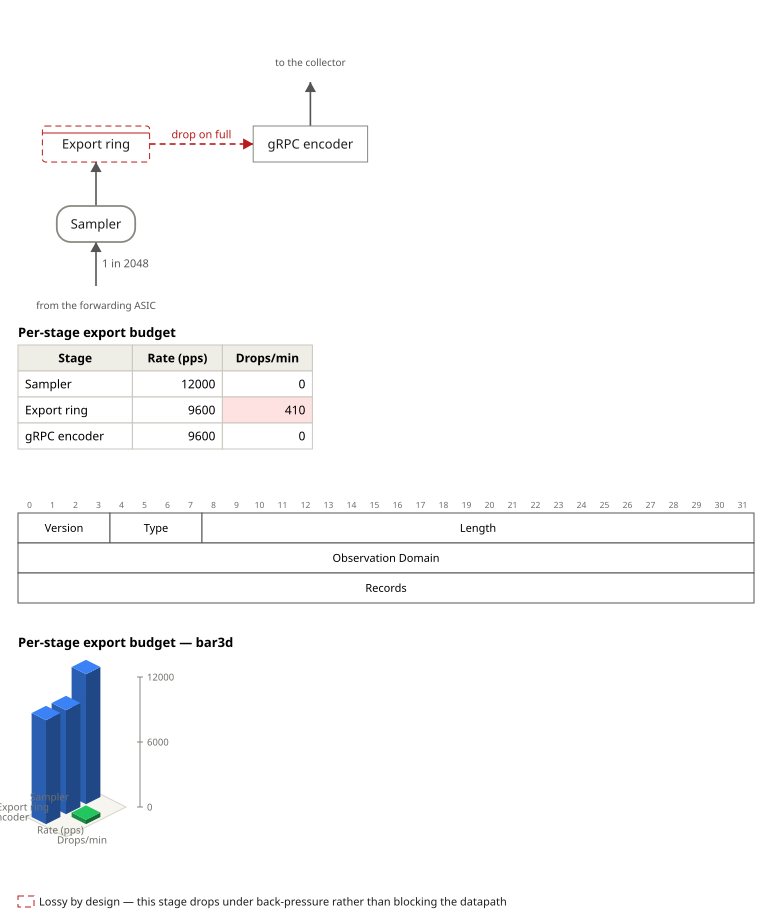

### Partition map — pool with global thresholds  — [source](partition-map.fd)
The same block constructs plus `threshold`/`band` markers cover buffer
quotas, memory maps, and watermark charts.

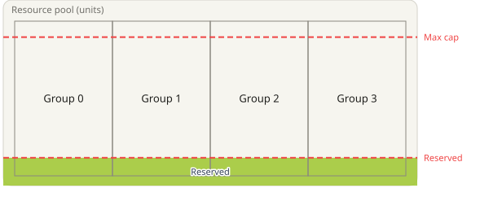

### Annotated datapath — the drawn annotation  — [source](annotated-datapath.fd)
`note=` (`figdown 0.3`) is prose the **human** must see, attached to an element
by writing it on that element's own line — here on a `node`, a `group`, an
`edge` and on `title` (the figure-level note). It is not `description=`, which
reaches only the **machine** as an SVG `<title>` and puts no ink on the page;
the two divide by audience, and neither is a fallback for the other. The author
never places the box (`DOMAIN-CONVENTION-DIRECTIVES`): the engine sits it beside its carrier and reaches
for a leader line only when adjacency fails.

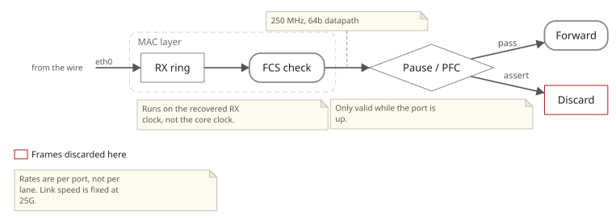

## Topology (with semantic annotations)

### VXLAN/EVPN Leaf-Spine Fabric  — [source](evpn-fabric.fd)
One source file, **multi-section `MULTI-FIGURE-DOCUMENTS`**: a topology scene section plus later
`figdown 0.1 table` sections for the VNI mapping and fabric-plane tables
that real design docs put next to it (one stacked SVG; `GENRE-KEYWORD-ALLOWLIST` per section).

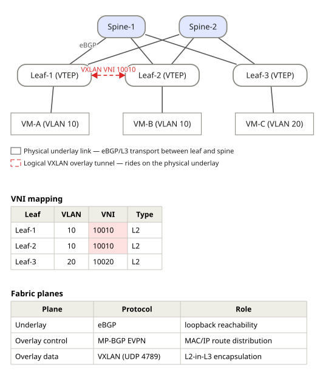

### EVPN-VXLAN IRB — vendor-style leaves with VRF/BD detail  — [source](srl-evpn-irb.fd)
Semantic recreation of a vendor doc figure: fabric overlay, leaf boxes
holding IP-VRF badges and dashed bridge domains, port labels on links,
a `bundle` multi-homing ring, multi-line host captions.

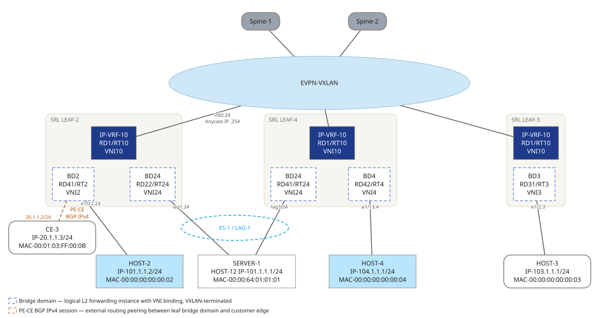

### Three-link aggregation — naming one link of several  — [source](link-bundle-lag.fd)
The figure the language could not write before `figdown 0.5`. A `bundle` is
defined as *parallel links between one pair of devices operated as one logical
link* — a LAG, an ECMP set, an Ethernet Segment — and its members used to be
named by endpoint pair, which between these two switches names three links at
once. Each member carries an `id=` and the bundle names the ids. The ids are
handles and nothing else: `m1` does not say the link is first or primary, the
interface names are in the end labels, and the membership claim is on the
`bundle` line. The management link is deliberately anonymous — a connector
nobody needs to name does not need an id, and its absence asserts nothing.

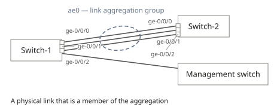

### Private VLAN — figure plus rule table  — [source](pvlan-flows.fd)
A worked example of the figure-plus-prose mode
(`COMPLETENESS-DEFINITION` mode 3): one `.fd`, two
complementary halves as **multi-section `MULTI-FIGURE-DOCUMENTS`** (scene section, then
`figdown 0.1 table`) planned as a single deliverable / one stacked SVG.
The figure carries the shape — promiscuous port, two communities, two
isolated ports, permitted flows drawn bidirectionally because VLAN
reachability is symmetric — with the three VLAN types as `class`
declarations, so the meaning is machine-readable on every edge
(`class=vidi`) and the legend strip derives automatically. The
`reach` table section carries what no arrangement of arrows can state:
the PROHIBITIONS in words (an isolated port may not reach another
isolated port, though both sit in VID_I), plus the closed-world
declaration that anything not listed as reachable is denied. Read the
two together; a missing edge is never the argument.
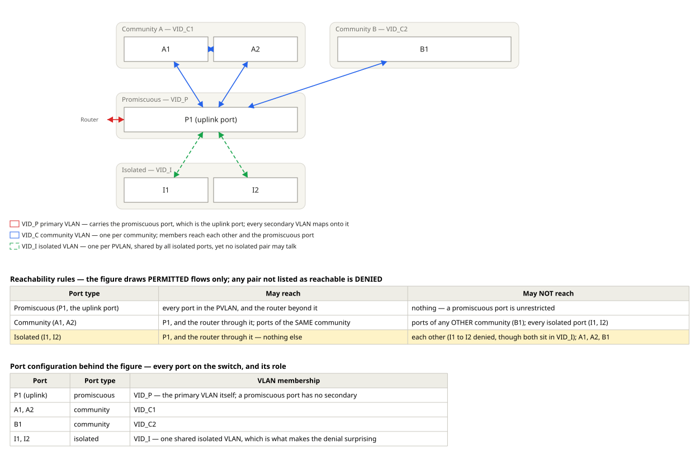

## Protocol headers (bitfield, census #2)

> **This set was cut from sixteen headers to nine.** Seven of
> them (ARP, BGP, DHCP, Ethernet II, ICMP, ICMPv6, VXLAN, and a second TCP)
> exercised no construct that another header in this list did not already
> exercise; a gallery is a demonstration of CAPABILITY, and a ninth
> `word=32 numbering=msb0` header teaches nothing a reader did not learn from
> the eighth. Each survivor is here for something only it shows:
>
> | Figure | What only it demonstrates |
> |---|---|
> | `udp` | the 9-line minimum — a complete, valid figure with nothing optional in it |
> | `ipv6` | a complete fixed-length header, and a 128-bit field spanning four rows as ONE box |
> | `dns` | `word=16`, the compact `name:width` field form, and `break` |
> | `ipv4` | `present=""` (written empty) beside `present="IHL > 5"` |
> | `gre` | the only `field ""`; conditional presence plus a `class` for the co-dependency |
> | `mpls` | `break` as a structural separator (cited by name in spec/core §12.7) |
> | `quic` | multi-word structure |
> | `srh` | `index=` with an opaque range end, two blocks, `word=8` |
> | `showcase/tcp-header` | the long and compact flag forms side by side, `class=varword`, `*` |

### IPv4 — RFC 791  — [source](ipv4.fd)
The variable-length tail: Options is `*` (length not in the document) plus
`present="IHL > 5"` (absent when IHL = 5). `*` always runs to the end of its row, so
Padding is drawn on the next row rather than beside Options as RFC 791
draws it.
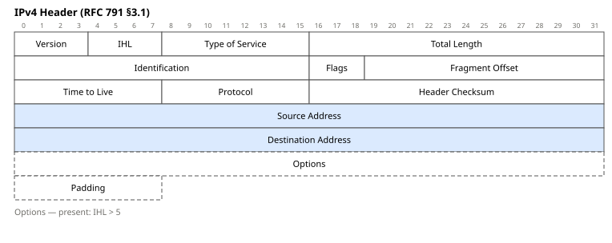

### UDP — RFC 768  — [source](udp.fd)
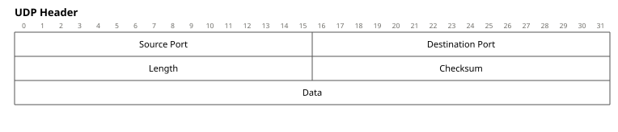

### IPv6 — RFC 8200  — [source](ipv6.fd)
Each 128-bit address is ONE field spanning four 32-bit rows, and it draws as
one box with no rules between them and its name written once — RFC 8200 §3's
own `+   +` convention. An exact transcription of that section:
4+8+20 + 16+8+8 + 128 + 128 = the fixed 40 octets.
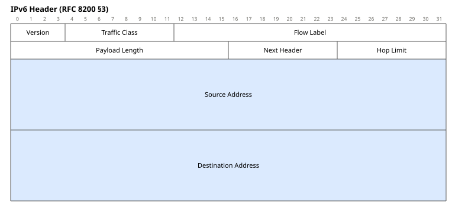

### GRE — RFC 2784/2890  — [source](gre.fd)
The conditional-presence case: Checksum and Reserved1 present iff C = 1,
Key iff K = 1, Sequence Number iff S = 1. `present="C = 1"` etc. on each
field states and draws that field's own condition; the paired fields also
share a `class` (`ifc`/`ifk`/`ifs`) stating the CO-DEPENDENCY between them,
because presence cannot reference another field by name.
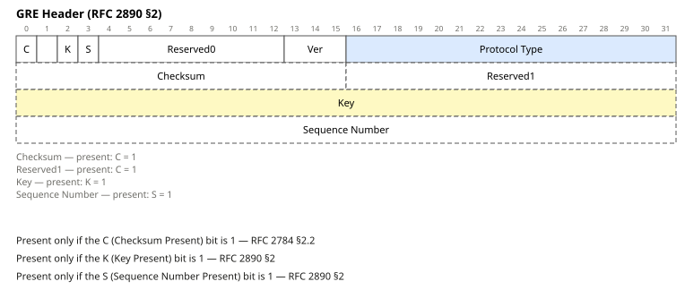

### IPv6 Segment Routing Header — RFC 8754  — [source](srh.fd)
The variable-count repeating case, and the first adopter of `index=`. RFC
8754 §2 draws Segment List[0], a literal `...` row, then Segment List[n] —
(Last Entry + 1) elements of 128 bits each. The figure declares the element
**once**, with `index="0..Last Entry"`, and the engine derives that whole
drawing — first element, elision, last element, each carrying its index — from
that one key. What is left open is the count
alone: `Last Entry` is the name of a field this language cannot resolve, so
the run is indeterminate — reached now from syntax rather than from reading a
label. The header comment says exactly what that still costs a reader.
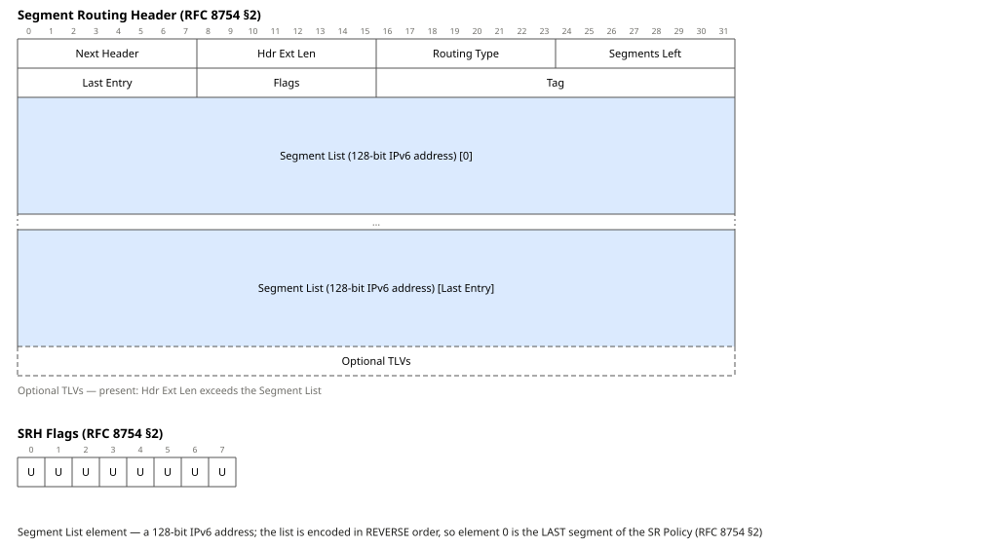

### MPLS label stack — RFC 3032  — [source](mpls.fd)
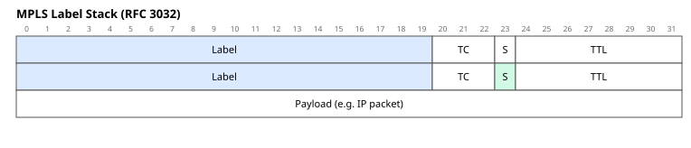

### DNS message header — RFC 1035  — [source](dns.fd)
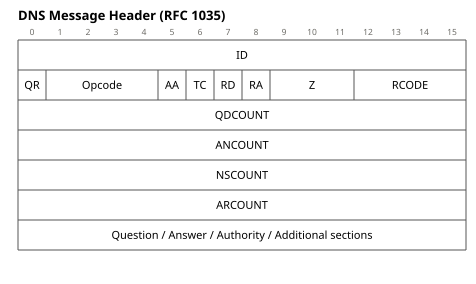

### QUIC long header — RFC 9000  — [source](quic.fd)
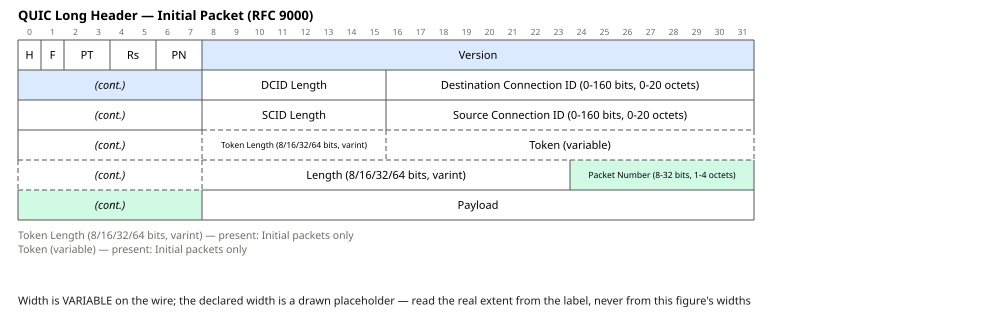

## Tables & data (census #3)

### Queue-occupancy heatmap  — [source](queue-heatmap.fd)
One table, two projections: a heatmap (per-cell marks) and a `chart`
bar3d projection — rows→X, columns→Y, values→Z.

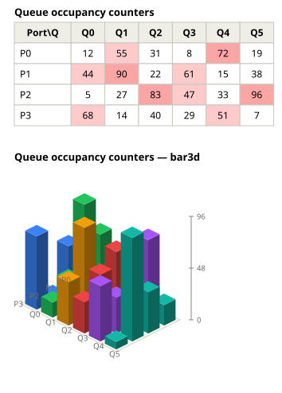

## Procedures (flowchart — EXPERIMENTAL genre)

### Packet ingress path — the role vocabulary at work  — [source](packet-ingress.fd)
The flowchart role keywords (`process` / `decision` / `terminator`) on a subject that needs all of them: a receive → parse →
**five-way EtherType dispatch** → per-protocol check → drop/forward path,
with the VLAN branch looping back so a double-tagged frame unwinds. The
dispatch is deliberately drawn as an `ellipse` — the layout choice real
corpus figures make, because an ellipse is narrower than a diamond — which
under the old `node … shape=` spelling would have erased the fact that it is
a branch point at all. Here the word carries it and the drawing is free.

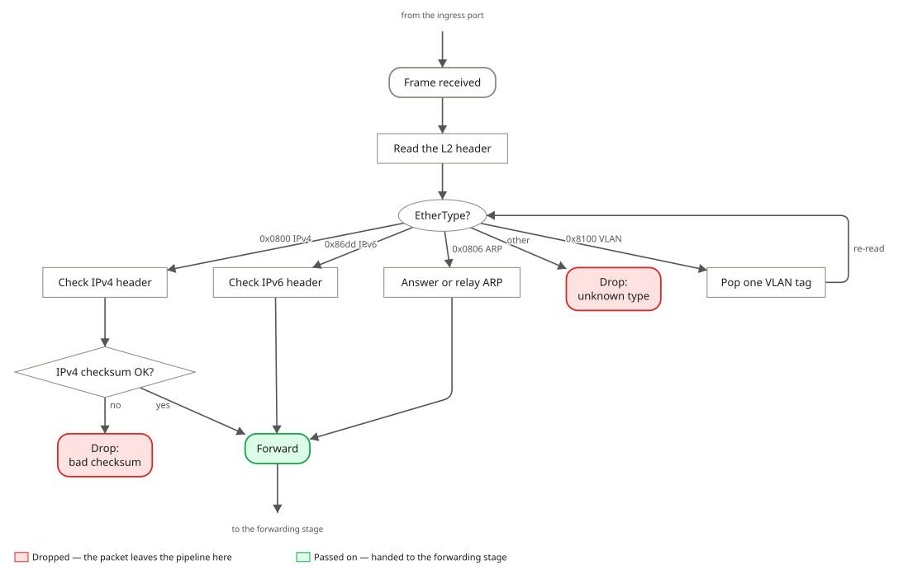

### RPF check — a procedure that reads right to left  — [source](rpf-check.fd)
Four constructs that had no demonstrator anywhere before 0.1, gathered
into one small figure: `flow left` (the corpus was `right` and `down` only),
the `\"` escape inside a quoted label, a `#` inside a bracketed edge label
(verbatim since `VERBATIM-REGION-SCOPE`), and a
negative `at=` coordinate. It was a `block` figure until 0.4, with the
stage roles carried by `shape=` and asserted by nothing; converting it to
`flowchart` puts them in the words and lets the geometry derive — the same
trade `packet-ingress` makes above, paid on a figure that already existed. It
is also the corpus's only `figdown 0.1 flowchart` document, so it is where the
version-gated connector spelling is visible: `edge` at 0.1, `flowline` at 0.2.

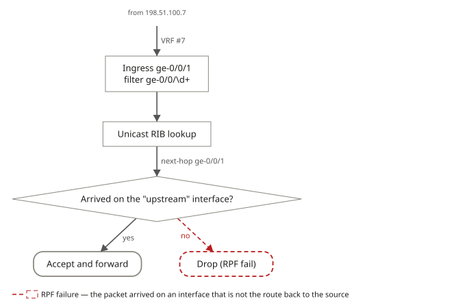

## Interactions (sequence — EXPERIMENTAL genre)

Time-ordered exchanges drawn as ladders: `lifeline` columns, `message` rows in
source order, `state` occurrences on a lifeline, and `fragment` frames saying
what kind of run a group of messages is. Both figures and what each one is for
are in [sequence/index.md](sequence/index.md); the genre is experimental and
its withdrawal price is not one line per figure, so read
[spec/genres/experimental/sequence.md](../spec/genres/experimental/sequence.md)
before authoring one.

### DHCP lease acquisition, renewal and release  — [source](sequence/dhcp-lease.fd)
The genre's **showcase**, and the same protocol as
[statechart/dhcp-client.fd](statechart/dhcp-client.fd) deliberately drawn in the
other genre: that figure's lines are transitions of one machine, these are
messages between three participants. It is the only figure in the corpus that
says **when** a state change happens relative to the messages around it —
SELECTING inside the retransmit loop, BOUND inside the operand that earned it,
the whole reacquisition cycle as a loop with its state changes inside it — and
it carries four honest limits in its source, starting with the one every
message in this genre has: a message is one instant, with no separate send and
receive.

### All twelve interaction operators  — [source](sequence/fragment-operators.fd)
Every value of the fragment `type=` enum — `alt` `opt` `loop` `par` `strict`
`seq` `critical` `neg` `assert` `ignore` `consider` `break` — each written on
the part of one ordinary client/service session where it is actually true. Six
of the twelve are the ones Mermaid documents; the other six have no other
demonstrator here, which is what taking a closed enumeration whole costs and
buys.

## Algorithms & data structures

### Hash table with chaining  — [source](hash-chaining.fd)
Bucket-array group, empty and occupied slots, pointer edges to
singly-linked entry chains — a static data-structure explainer.
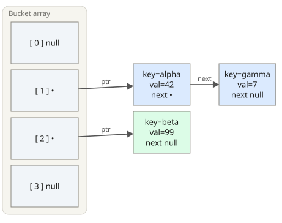

## Just for fun

### Rainbow rings — [source](rainbow.fd)
Document order is paint order — (`PAINT-ORDER-CONSTRUCT`) the only paint order
the language has. Seven concentric `ellipse` nodes; later lines paint on top.

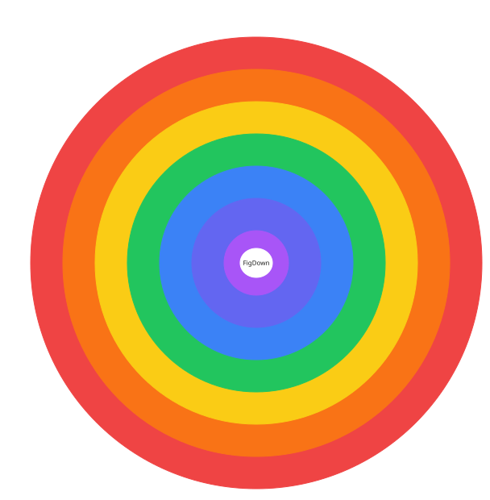

## Showcase set (`showcase/`)

The six figures walked through in [guide/showcase.md](../guide/showcase.md) — each one is
presented there with its source, what a human sees, what an agent can
answer from the text alone, and what the figure still cannot say. The sources
live here; read them beside that document.

| Figure | Genre | Source | Walk-through |
|---|---|---|---|
| TCP header — bit-exact machine-readable layout | `bitfield` | [tcp-header.fd](showcase/tcp-header.fd) · [.svg](showcase/tcp-header.svg) | [guide/showcase.md §1](../guide/showcase.md#1-tcp-header--bit-exact-machine-readable-layout-bitfield) |
| TCP three-way handshake — labelled directed exchange, plus a state `table` in the same document | `topology` | [tcp-handshake.fd](showcase/tcp-handshake.fd) · [.svg](showcase/tcp-handshake.svg) | [guide/showcase.md §2](../guide/showcase.md#2-tcp-three-way-handshake--labelled-directed-exchange-topology) |
| L2 switch forwarding decision — protocol logic as a readable decision flow | `flowchart` | [l2-forwarding-logic.fd](showcase/l2-forwarding-logic.fd) · [.svg](showcase/l2-forwarding-logic.svg) | [guide/showcase.md §3](../guide/showcase.md#3-l2-switch-forwarding-decision--protocol-logic-readable-flowchart) |
| Ethernet II frame — byte order carried by syntax, not by geometry | `table` | [ethernet-frame.fd](showcase/ethernet-frame.fd) · [.svg](showcase/ethernet-frame.svg) | [guide/showcase.md §4](../guide/showcase.md#4-ethernet-ii-frame--byte-order-carried-by-syntax-table) |
| ARP resolution — `external` and `class` discipline, plus a cache-transition `table` | `topology` | [arp-resolution.fd](showcase/arp-resolution.fd) · [.svg](showcase/arp-resolution.svg) | [guide/showcase.md §5](../guide/showcase.md#5-arp-resolution--external--class-discipline-topology) |
| TCP connection state machine — 11 states, 21 transitions, all of RFC 9293 Figure 5 | `flowchart` | [tcp-state-machine.fd](showcase/tcp-state-machine.fd) · [.svg](showcase/tcp-state-machine.svg) | [guide/showcase.md §6](../guide/showcase.md#6-tcp-connection-state-machine--every-state-every-transition-flowchart) |

## Layout before / after set (`layout-compare/`)

Two figures, each shown with an empty layout zone and with layout intent added.
The content zones are byte-identical within each pair — that is the point. The
**tuned** side is the top-level example itself, not a
copy: until 0.1 this directory held `*-tuned.fd` files that were
md5-identical to `examples/evpn-fabric.fd` and `examples/srl-evpn-irb.fd`,
which is a duplicate rather than a demonstration. Measurements and the reading of each pair are in
[guide/layout.md §7](../guide/layout.md#7-before--after-the-same-semantics-different-layout-zones).

**The second auto arm has no `.svg`, on purpose.** Auto-layout cannot place
that figure's three leaf groups' members contiguously — each group's members
land on different ranks with the other groups' members and five hosts between
them, so a band would have to span the canvas — and the engine
refuses to draw a `group` band around a non-member rather than state a
membership the source never wrote. `node tools/build-svg.js
layout-compare/srl-evpn-irb-auto.fd` reports `Line 25: group "leaf4" would
enclose non-member "h2" and the layout pass could not separate them; the figure
is not drawn rather than drawn wrongly.` (the named node may differ between
runs) and writes nothing. The source stays: **the refusal is what the auto arm
now demonstrates** — this topology needs `pin` until auto-layout learns
group-aware rank assignment (engine-backlog item 32).

| Pair | auto | tuned | What the tuning adds |
|---|---|---|---|
| VXLAN/EVPN leaf-spine fabric | [.fd](layout-compare/evpn-fabric-auto.fd) · [.svg](layout-compare/evpn-fabric-auto.svg) | [.fd](evpn-fabric.fd) · [.svg](evpn-fabric.svg) | `flow down` + two `rank` lines — three semantic lines, no `pin`; edge length halves |
| EVPN-VXLAN IRB (16 nodes, three leaf groups) | [.fd](layout-compare/srl-evpn-irb-auto.fd) — **refused, no artifact** | [.fd](srl-evpn-irb.fd) · [.svg](srl-evpn-irb.svg) | 20 layout lines using groups as layout modules (two-level `pin`); they are what makes the figure renderable at all, not a polish pass |

---

More waves per the gallery plan: the full header
set, protocol negotiation sequences, algorithm & data-structure
figures, and math-annotated figures.
