# FigDown 範例藝廊

> 下方每張圖都是由旁邊的 `.fd` 文字檔確定性生成的 SVG
> （`node tools/build-svg.js examples/`）。每個 SVG 內嵌自身來源與
> SHA-256——用文字編輯器打開任何一個，就能看到「一份來源、兩種
> 讀者」的實際樣貌。
>
> 分區對應 template 家族，依圖型普查佔比排序
> （[census.zh-tw.md](../census.zh-tw.md)）。
>
> English version: [index.md](index.md)
>
> 另見[結構模式庫](patterns/index.zh-tw.md)——蒸餾自真實 774 份
> 文件語料的通用骨架。

## 方塊與架構（普查第 1）

### VXLAN 封裝 — 封裝前後訊框對照 — [來源](vxlan-encap.fd)
古典訊框 vs VXLAN 訊框（原始 L2 訊框內嵌）、VLAN→VNI 箭頭、
overhead 與重點對照表。

### 分割圖 — 資源池與全域門檻 — [來源](partition-map.fd)
同樣的 block 構件加上 `line`/`fill` 標記，即涵蓋緩衝配額、
記憶體映射、水位圖。

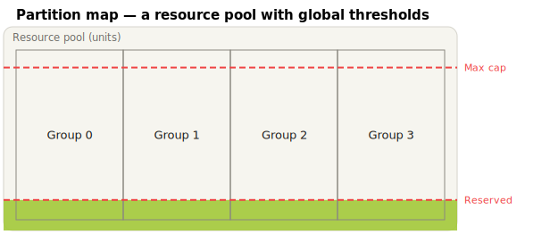

## 拓撲（含語意註記）

### VXLAN/EVPN Leaf-Spine 架構 — [來源](evpn-fabric.fd)
單一來源檔：拓撲（含 VXLAN 隧道 overlay 圖層）加上真實設計文件
會放在旁邊的 VNI 對照表與平面說明表。

### EVPN-VXLAN IRB — 廠商風格的 leaf/VRF/BD 細節 — [來源](srl-evpn-irb.fd)
對廠商文件圖的語意重建：fabric 雲、leaf 框內含 IP-VRF 徽章與虛線
bridge domain、連線埠標籤、`bundle` 多歸屬圈、多行主機說明。

## 協議標頭（bitfield，普查第 2）

### Ethernet II（+ 選用 802.1Q）— [來源](ethernet-ii.fd)

### IPv4 — RFC 791 — [來源](ipv4.fd)

### TCP — RFC 9293 — [來源](tcp.fd)

### UDP — RFC 768 — [來源](udp.fd)

### VXLAN — RFC 7348 — [來源](vxlan.fd)

### ARP — RFC 826 — [來源](arp.fd)
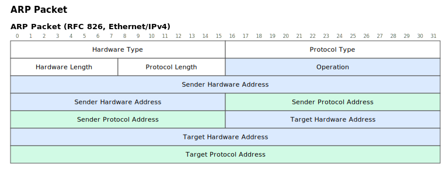

### IPv6 — RFC 8200 — [來源](ipv6.fd)
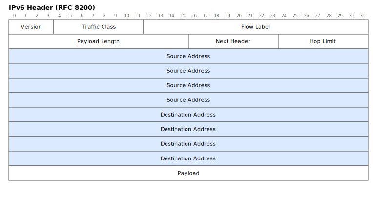

### ICMP — RFC 792 — [來源](icmp.fd)

### ICMPv6 — RFC 4443 — [來源](icmpv6.fd)
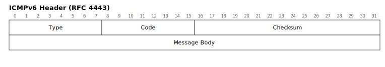

### GRE — RFC 2784/2890 — [來源](gre.fd)
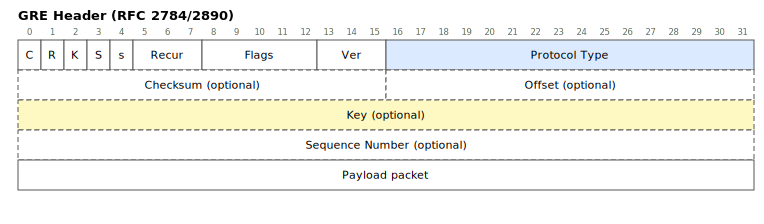

### MPLS label stack — RFC 3032 — [來源](mpls.fd)
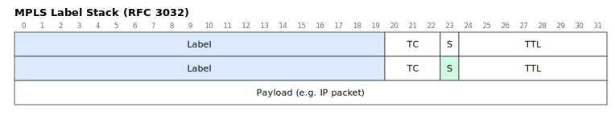

### DNS 訊息標頭 — RFC 1035 — [來源](dns.fd)
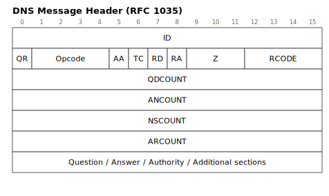

### DHCP — RFC 2131 — [來源](dhcp.fd)
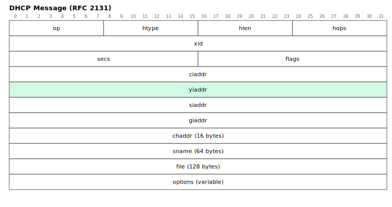

### QUIC long header — RFC 9000 — [來源](quic.fd)
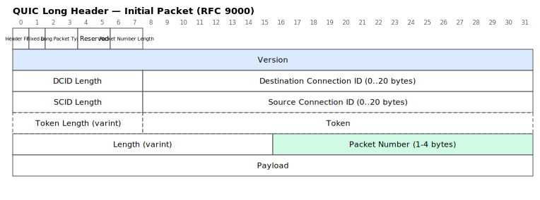

### BGP 訊息標頭 — RFC 4271 — [來源](bgp.fd)
128-bit 的 Marker 是「一個」欄位、自動跨四個 32-bit 列——寬於
unit 的欄位自動延續。
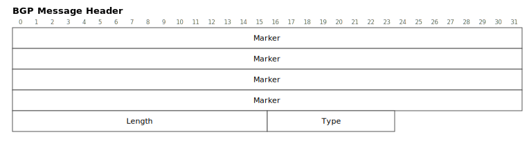

## 表格與數據（普查第 3）

### 佇列佔用熱圖 — [來源](queue-heatmap.fd)
一份表格、兩種投影：熱圖（儲存格標記）與 `plot` bars3d 圖
（含門檻平面）——列→X、欄→Y、值→Z。


## 演算法與資料結構

### 雜湊表與鏈結法 — [來源](hash-chaining.fd)
桶陣列群組、空槽與佔用槽、指標連線到單向鏈結的項目鏈——靜態
資料結構講解圖。

## 純屬好玩

### 彩虹圈圈 — [來源](rainbow.fd)
一個 `layer` 指令都沒用：行序就是圖層。七個同心 `cloud` 節點，
後寫的行蓋在上面。

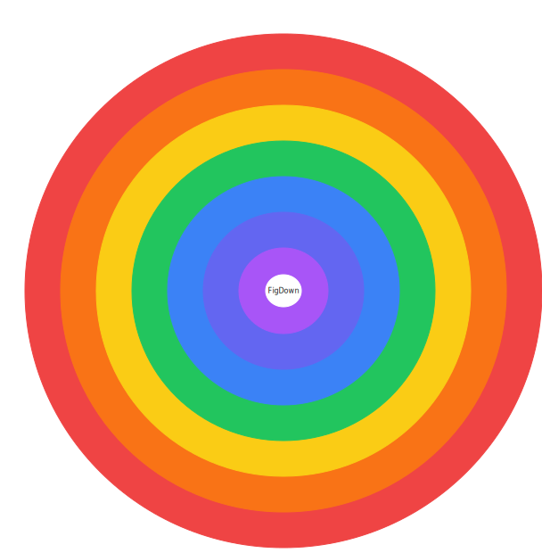

---

後續梯次見[藝廊規劃](../gallery-plan.zh-tw.md)：完整標頭集（E1）、
協議協商時序（E2）、演算法與資料結構圖（E3）、含數學註記的圖（E4）。
