# FigDown 範例藝廊

> 下方每張圖都是由旁邊的 `.fd` 文字檔確定性生成的 SVG
> （`node tools/build-svg.js examples/`）。每個 SVG 內嵌自身來源與
> SHA-256——用文字編輯器打開任何一個，就能看到「一份來源、兩種
> 讀者」的實際樣貌。
>
> English version: [index.md](index.md)

## 旗艦範例：拓撲 + 隨附知識

### VXLAN/EVPN Leaf-Spine 架構 — [來源](evpn-fabric.fd)
單一來源檔：拓撲（含 VXLAN 隧道 overlay 圖層）加上真實設計文件
會放在旁邊的 VNI 對照表與平面說明表。

### EVPN-VXLAN IRB — 廠商風格的 leaf/VRF/BD 細節 — [來源](srl-evpn-irb.fd)
對廠商文件圖的語意重建：fabric 雲、leaf 框內含 IP-VRF 徽章與虛線
bridge domain、連線埠標籤、多行主機說明。全手工釘位（第 3 層排版）。

### VXLAN 封裝 — 封裝前後訊框對照 — [來源](vxlan-encap.fd)
古典訊框 vs VXLAN 訊框（原始 L2 訊框內嵌）、VLAN→VNI 箭頭、
overhead 與重點對照表。

## 協議標頭（bitfield template）

### Ethernet II（+ 選用 802.1Q）— [來源](ethernet-ii.fd)

### IPv4 — RFC 791 — [來源](ipv4.fd)

### TCP — RFC 9293 — [來源](tcp.fd)

### UDP — RFC 768 — [來源](udp.fd)

### VXLAN — RFC 7348 — [來源](vxlan.fd)

---

後續梯次見[藝廊規劃](../gallery-plan.zh-tw.md)：完整標頭集（E1）、
協議協商時序（E2）、演算法與資料結構圖（E3）、含數學註記的圖（E4）。
