# Structure Pattern Library

> Fourteen de-identified structural skeletons distilled from the
> figure-type census over a real 774-document corpus: for each major
> figure family, agents read real samples and re-expressed **only the
> structure** with generic placeholder labels — no content, no terms,
> no fingerprints. Use them as starting templates: replace the labels,
> keep the shape.
>
> 繁體中文版：[index.zh-tw.md](index.zh-tw.md)

## Block & architecture
- [block-a](block-a.fd) — parallel lanes fanning into a collector
  
- [block-b](block-b.fd) — containment tiers with cross-tier dashed feedback
  

## Register / packet bit layouts
- [bitfield-a](bitfield-a.fd) — one control word: flag run + wide fields + reserved (lsb0)
  
- [bitfield-b](bitfield-b.fd) — multi-word descriptor with a variable tail
  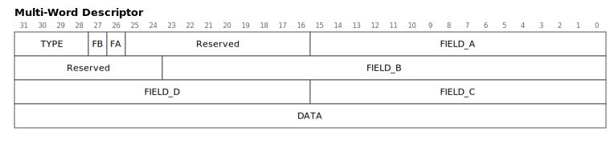

## Tables
- [table-a](table-a.fd) — two-tier merged header + rowspan label column
  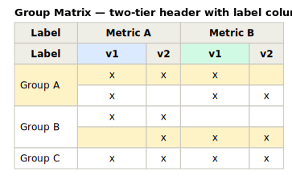
- [table-b](table-b.fd) — rowspan/colspan merges + per-cell colors + row highlights
  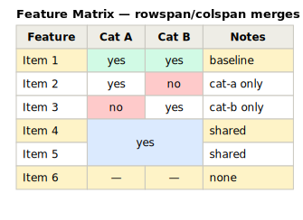

## Flowcharts
- [flowchart-a](flowchart-a.fd) — two sequential decisions, branches converging
  
- [flowchart-b](flowchart-b.fd) — retry loop-back
  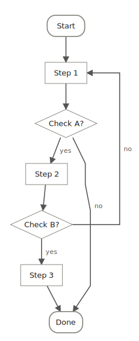

## Timing / waveforms
- [wave-a](wave-a.fd) — clocked request/acknowledge handshake
  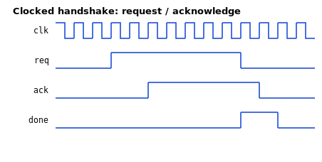
- [wave-b](wave-b.fd) — valid + labelled data-bus segments
  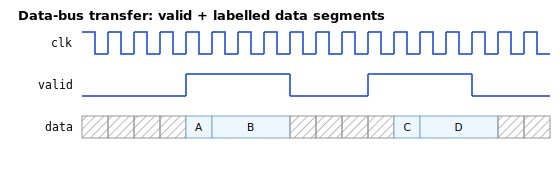

## Topologies
- [topology-a](topology-a.fd) — two tiers, full mesh, port labels
  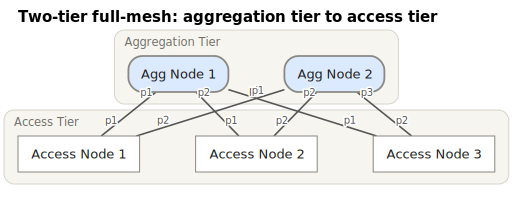
- [topology-b](topology-b.fd) — chain with a redundant pair and a link bundle
  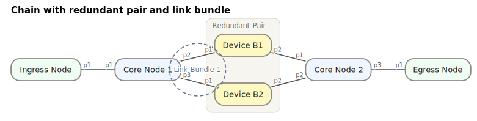

## State machines
- [state-a](state-a.fd) — cycle with retry/abort back-edges
  
- [state-b](state-b.fd) — hub: states converging to reset
  

## Entity-relationship (blocks-first, R36)
- [erd-a](erd-a.fd) — entities as multi-line nodes (PK/FK in label
  text), relationships with an inline verb and cardinality endpoint
  labels
  
