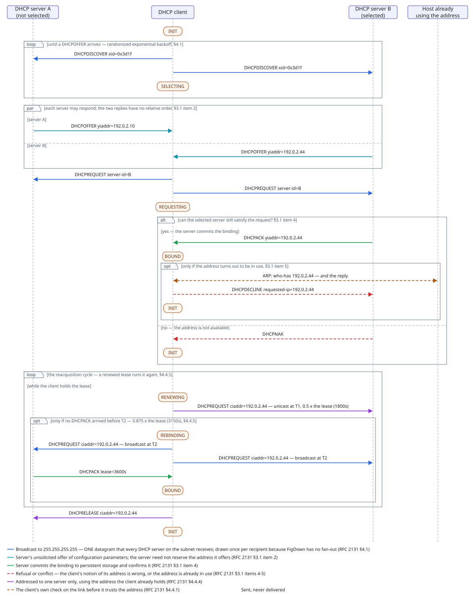
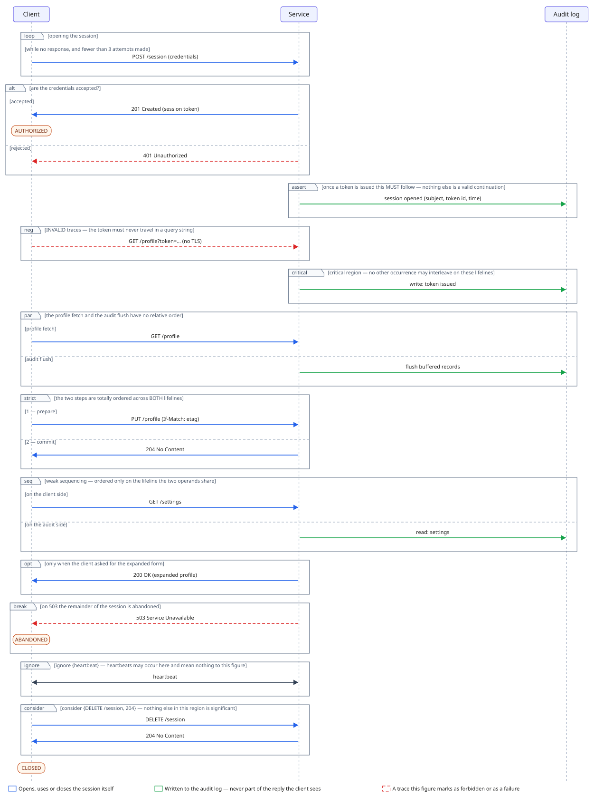

# Sequence figures — interaction ladders

> These figures use **`figdown 0.4 sequence`**: participants as `lifeline`
> columns, time running down the page, `message` lines in source order,
> `state` occurrences on a lifeline, and `fragment` + `operand` frames that
> say what kind of run a group of messages is.
>
> **The genre is EXPERIMENTAL.** It is outside the conformance
> surface and outside the compatibility promise, and it may change or be
> withdrawn in a later `0.x` with no migration — and unlike `statechart`,
> withdrawal here would not be one line per figure. Read
> [spec/genres/experimental/sequence.md](../../spec/genres/experimental/sequence.md)
> before authoring one.

| Example | What only it demonstrates | Source |
|---|---|---|
| DHCP lease | The genre's **showcase**: the whole life of one lease — acquisition (RFC 2131 §3.1, Figure 3), the address check of §4.4.1, the T1/T2 reacquisition cycle of §4.4.5, and the release. All five keywords, four of the twelve operators, all three message operators, `in=` on **all five** of its acceptors, a `state` **inside** a fragment, and one level of fragment nesting — twice | [dhcp-lease.fd](dhcp-lease.fd) · [svg](dhcp-lease.svg) |
| Twelve interaction operators | Every value of the fragment `type=` enum — `alt` `opt` `loop` `par` `strict` `seq` `critical` `neg` `assert` `ignore` `consider` `break` — each on the part of one ordinary client/service session where it is actually true. Six of the twelve are what Mermaid documents; the other six have no other demonstrator in this repository | [fragment-operators.fd](fragment-operators.fd) · [svg](fragment-operators.svg) |

```bash
node tools/build-svg.js examples/sequence
```

## DHCP lease acquisition, renewal and release

The same protocol as [`../statechart/dhcp-client.fd`](../statechart/dhcp-client.fd),
and deliberately a different genre. That figure's subject is one machine's
modes, and the lines between them are transitions; this one's subject is three
participants exchanging messages in time, and the lines between them are
messages. Drawn as a scene, the seven exchanges between this client and one
server would fan into a single span and a reading agent would answer *seven
links join the client and the server* — confidently, and wrongly.

What the rest of the corpus cannot say and this figure does: **when** each state
change happens relative to the messages around it. `SELECTING` is drawn inside
the retransmit `loop`, because the client leaves INIT on sending the first
DHCPDISCOVER and every retransmission after that happens in SELECTING.
`BOUND` is drawn inside the `alt`'s granted operand, so the DHCPNAK operand
visibly does not reach it. The reacquisition cycle is a `loop` with its three
state changes inside it, and the T1/T2 firings ride in the message labels,
because vertical distance in this genre carries no duration.

It is also the first authored figure to write `in=` on a `lifeline` — the rare
fifth acceptor, which says a participant exists only inside a fragment. Here it
is the host that already holds the address, which takes part in nothing outside
the address check. The model records that; the drawing does not shorten the
column, and the source says so.

The source states its limits rather than leaving them to be noticed, and four
of them are worth reading beside the picture. A message is **one instant** —
no separate send and receive, so no propagation delay and no two messages
crossing on the wire. There is no way to re-order one chosen pair inside a
`par`. A lifeline's state occurrences are **one sequence**, so the DHCPNAK and
DHCPDECLINE paths cannot both end in a drawn INIT. And a **meaning-only class**
— the idiom for a message that was sent and never delivered — puts no ink on
the page: the legend prints the meaning, the source and the message's
`description=` carry the reason, and the picture alone cannot say which arrow
it was.



## All twelve interaction operators

A `fragment`'s `type=` is mandatory — there is no default, because a frame drawn
with no operator would look like an assertion and would not be one — and it
takes one of twelve values. This figure writes all twelve on one small session:
a client opening a session with a service that keeps an audit log. The subject
is ordinary on purpose; what is being shown is the operator, and each frame's
label states the claim the operator makes.

Two limits carried in the source: `ignore` and `consider` take a set of message
names, and `loop` takes bounds, and `fragment` has no argument slot — so those
sets and bounds live in the label as prose a reader can quote and a parser
cannot read. And every frame here is a sibling: nesting is demonstrated in the
DHCP figure instead, so that this one demonstrates the enum and nothing else.



## Reading the pictures

Both figures are drawn by the ladder layout, which owns every coordinate: the
author states who talks to whom, in what order, inside which frame, and what
condition each participant is in. There is no key anywhere in this genre that
moves a mark — `pin` parses and is ignored, and `flow` and `rank` are not
words here at all, because both axes are already ordered by the source.

**Neither drawing carries its `title`, and that is the build's choice, not
the renderer's.** The default render draws no title in ANY genre, and every
published artifact is built without `--with-title`; with the flag, the ladder
draws its title exactly as the scene renderer does (same band, same text,
verified — the correction of an earlier note here that blamed
the ladder renderer). The document title always reaches the artifact through
the embedded source.
