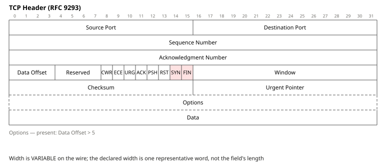
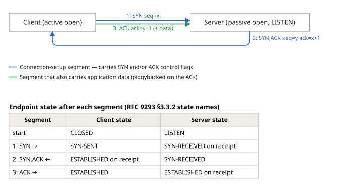
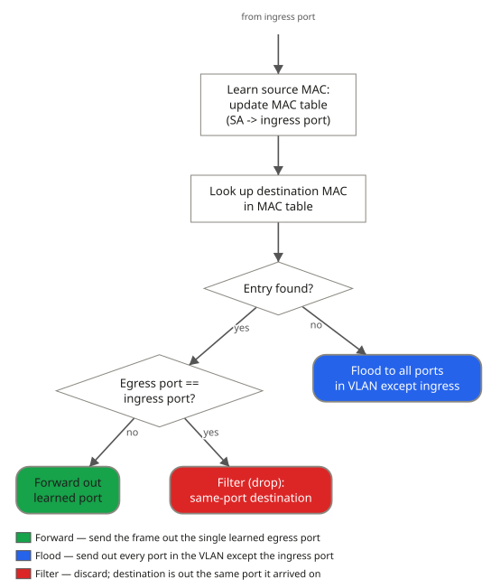
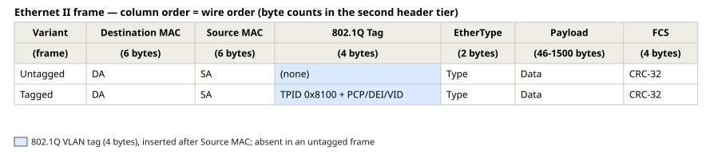
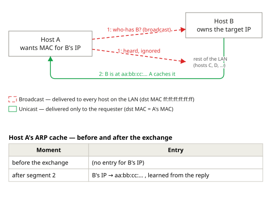
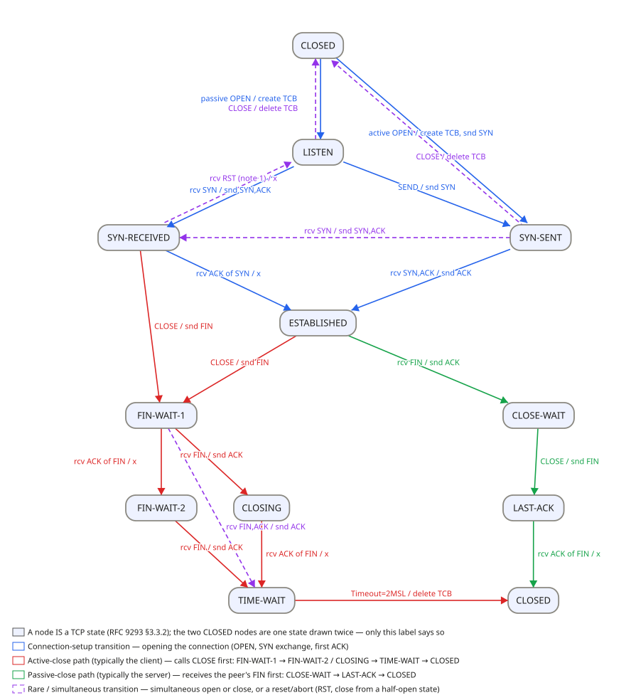

# FigDown capability showcase — one source, two readers

A FigDown figure is a single `.fd` text: a human opens the rendered SVG and
*sees* it; an agent opens the same text and *reads* it — answering questions
about widths, bit positions, message order, and decision logic without a
pixel. These six classic networking figures each demonstrate one advantage as
an agent skill: the agent writes the `.fd` (not brittle ASCII art), the human
gets a clean SVG, and a second agent reads the text back to answer questions
that would otherwise need OCR. The sixth — the complete TCP state machine —
is the stress test: every state and every labelled transition of RFC 9293
Figure 5 on one canvas.

Each entry: the rendered SVG, the `.fd` itself with its comment banners
elided, one line on what the human sees, and questions an agent answers **from the text alone**. Every colour and
dash is carried by a `class` whose label states its *meaning*; no meaning rides
on geometry (`tools/strip-check.js --strict`) or presentation.

Two of these figures — the TCP handshake and ARP resolution — are deliberately
**multi-section hybrids (`MULTI-FIGURE-DOCUMENTS`)**: a scene section *and* a later
`figdown 0.1 table` section in one `.fd`, stacked into one SVG.
Each section has one genre and its own id space (`GENRE-KEYWORD-ALLOWLIST` allowlist). This is the
main-standard answer for content the scene genre cannot yet carry first-class
(per-endpoint lifeline state; a local cache transition): a second section
carries it machine-readably, rather than letting it ride on geometry or
absence. Nested `table` under a single scene header is legacy, not the taught
path.

**A seventh figure family is missing from this page on purpose.** The
`sequence` genre (`SEQUENCE-GENRE-VOCABULARY`) draws the interaction ladders these
six cannot: time-ordered messages between participants, with each
participant's state on its own column and framed runs saying what kind of run
they are. It is **EXPERIMENTAL** and requires `figdown 0.4`; nothing below
declares a version later than `figdown 0.2`, which is where a reader deciding
whether to adopt the language actually has to judge it. Its two worked figures
are collected in
[examples/sequence/index.md](../examples/sequence/index.md), and the honest-limit
notes under §2 and §5 say exactly what they buy.

---

## 1. TCP header — bit-exact machine-readable layout (`bitfield`)



```figdown
figdown 0.1 bitfield
title "TCP Header"

bitfield tcp "TCP Header (RFC 9293)" word=32 numbering=msb0

field "Source Port" 16
field "Destination Port" 16
field "Sequence Number" 32
field "Acknowledgment Number" 32
field "Data Offset" 4 description="header length in 32-bit words; min 5 (=20 bytes), max 15 (=60 bytes)"
field "Reserved" 4 description="must be zero"
field "CWR" 1
field "ECE" 1
field "URG" 1
field "ACK" 1
field "PSH" 1
field "RST" 1
field "SYN" 1 fill=#fee2e2
field "FIN" 1 fill=#fee2e2
field "Window" 16 description="receive window size in bytes (subject to window scaling option)"
field "Checksum" 16
field "Urgent Pointer" 16
field "Options" 32 present="Data Offset > 5" description="padded to a 32-bit boundary"
field "Data" * description="variable-length payload; length from the IP datagram, not the TCP header"
```

**Human sees:** the RFC-style header — a 32-bit ruler, every field to width,
the eight flags as individual bit cells, Options dashed with a caption stating
its condition (`present=`).

**An agent answers from the text alone:**

- *Q: Which bits carry the window size?* A: bits 112–127 — the sum of preceding
  widths (96 for rows 1–3, then Data Offset 4 + Reserved 4 + eight 1-bit flags)
  places `Window` next. Derived from field order/width, not the drawing.
- *Q: Is SYN one bit or a byte?* A: one bit (`field "SYN" 1`); each of the eight
  flags is a distinct, individually addressable 1-bit field.
- *Q: When are Options present; what is the minimum header length?* A: present
  iff Data Offset > 5 (`present="Data Offset > 5"`, which also draws as a
  caption under the block); minimum header = 5 × 32-bit words = 20 bytes
  (Data Offset field's `description=`).

---

## 2. TCP three-way handshake — labelled directed exchange (`topology`)



```figdown
figdown 0.1 topology
title "TCP Three-Way Handshake"

class setup "Connection-setup segment — carries SYN and/or ACK control flags" stroke=#2563eb
class data  "Segment that also carries application data (piggybacked on the ACK)" stroke=#16a34a

node client "Client (active open)"
node server "Server (passive open, LISTEN)"

flow right

edge client -[1: SYN  seq=x]-> server class=setup
edge server -[2: SYN,ACK  seq=y ack=x+1]-> client class=setup
edge client -[3: ACK  ack=y+1  (+ data)]-> server class=data

# --- panel: separate genre section (multi-section `MULTI-FIGURE-DOCUMENTS`) ---
figdown 0.1 table
table state "Endpoint state after each segment (RFC 9293 §3.3.2 state names)"
| Segment            | Client state          | Server state              |
|--------------------|-----------------------|---------------------------|
| start              | CLOSED                | LISTEN                    |
| 1: SYN →           | SYN-SENT              | SYN-RECEIVED on receipt   |
| 2: SYN,ACK ←       | ESTABLISHED on receipt| SYN-RECEIVED              |
| 3: ACK →           | ESTABLISHED           | ESTABLISHED on receipt    |
```

This is a **multi-section hybrid**: a `topology` scene section *and* a
`table` section in one `.fd`, stacked into one SVG (`MULTI-FIGURE-DOCUMENTS`). The canonical RFC
9293 figure carries the per-endpoint state on the lifelines; the topology
genre has no lifeline-state construct, so the companion table section carries
those states machine-readably — multi-section composition is the main-standard
answer, and it is what a `figdown 0.1` document still writes now that the
`sequence` genre has landed (see the note below this section).

**Human sees:** two endpoints and three numbered segments — SYN out, SYN-ACK
back, ACK (with piggybacked data) out — with a state table below tracking each
endpoint's TCP state segment by segment.

**An agent answers from the text alone:**

- *Q: Which flags are set in segment 2?* A: SYN and ACK — from label `2: SYN,ACK`.
- *Q: Which segment carries data, in which direction?* A: segment 3,
  client → server — the only `data`-classed edge; its operator gives direction.
- *Q: What ack number does the client send last?* A: `ack=y+1`, acknowledging
  the server's SYN — from the segment-3 label.
- *Q: What state is the server in after receiving segment 1?* A: SYN-RECEIVED —
  row 2 of the state table (`1: SYN →`, Server state). Answerable only because
  the companion table carries the RFC 9293 lifeline states.

> **Honest limit (stated in the source), and what changed under it.** Message
> *order* here rides on the 1/2/3 label ordinals, not on a first-class
> construct — `MEANING-RECOVERY-SOURCE` does not treat numbering as semantics — and per-endpoint
> state rides on the companion table. **The `sequence` genre landed at
> 0.4 (`SEQUENCE-GENRE-VOCABULARY`) and expresses both structurally**: a `message`'s place
> in the ladder's row order *is* its place in time, and a `state` occurrence
> sits on a lifeline between the two messages it falls between. This figure
> nonetheless stays as written, and the reason is worth stating: `sequence` is
> **EXPERIMENTAL** and requires `figdown 0.4`, while this figure is a
> `figdown 0.1` document that any released engine can render. So the
> interim above is now a **choice this document can defend**, not a gap it is
> waiting on. What the ladder does with an exchange of this shape is shown by
> the genre's own figures, collected in
> [examples/sequence/index.md](../examples/sequence/index.md) — a DHCP lease from
> acquisition to release, and all twelve interaction operators. See also
> [expressing.md](expressing.md), "message exchange between parties".

---

## 3. L2 switch forwarding decision — protocol logic, readable (`flowchart`)



```figdown
figdown 0.2 flowchart
title "L2 Switch Forwarding Decision"

class forward "Forward — send the frame out the single learned egress port" fill=#16a34a
class flood   "Flood — send out every port in the VLAN except the ingress port" fill=#2563eb
class filter  "Filter — discard; destination is out the same port it arrived on" fill=#dc2626

external wire "from ingress port"

node learn  "Learn source MAC:\nupdate MAC table\n(SA -> ingress port)"
node lookup "Look up destination MAC\nin MAC table"
node hit    "Entry found?"                                 shape=diamond
node same   "Egress port ==\ningress port?"                shape=diamond
node fwd    "Forward out\nlearned port"                    shape=rounded class=forward
node fld    "Flood to all ports\nin VLAN except ingress"   shape=rounded class=flood
node flt    "Filter (drop):\nsame-port destination"        shape=rounded class=filter

flow down

flowline wire   -> learn
flowline learn  -> lookup
flowline lookup -> hit
flowline hit  -[no]->  fld
flowline hit  -[yes]-> same
flowline same -[yes]-> flt
flowline same -[no]->  fwd
```

**Human sees:** a frame from the ingress port → source-MAC learning →
destination lookup → two decisions branching into three colour-coded outcomes.

**An agent answers from the text alone:**

- *Q: When does the switch flood?* A: on a lookup miss — `hit -[no]-> fld`, and
  `fld` is the `flood` outcome (unknown-unicast and broadcast both take it).
- *Q: A hit whose destination is behind the ingress port?* A: filtered
  (dropped) — `same -[yes]-> flt`, class `filter`.
- *Q: Does learning happen before or after lookup?* A: before — the chain is
  `wire -> learn -> lookup`.

Closed-world: the three `class`-marked terminals are the *only* outcomes; there
is no unstated fourth path.

---

## 4. Ethernet II frame — byte order carried by syntax (`table`)



```figdown
figdown 0.1 table
title "Ethernet II Frame — Untagged vs 802.1Q Tagged"

class tag "802.1Q VLAN tag (4 bytes), inserted after Source MAC; absent in an untagged frame" fill=#dbeafe

table eth "Ethernet II frame — column order = wire order (byte counts in the second header tier)"
| Variant  | Destination MAC | Source MAC | 802.1Q Tag  | EtherType | Payload         | FCS       |
| (frame)  | (6 bytes)       | (6 bytes)  | (4 bytes)   | (2 bytes) | (46-1500 bytes) | (4 bytes) |
|----------|-----------------|------------|-------------|-----------|-----------------|-----------|
| Untagged | DA              | SA         | (none)      | Type      | Data            | CRC-32    |
| Tagged   | DA              | SA         | TPID 0x8100 + PCP/DEI/VID | Type | Data       | CRC-32    |
width 90,auto,auto,auto,auto,auto,auto
cell (1,4) class=tag
cell (2,4) class=tag
```

**Human sees:** the frame in wire order left-to-right, two variants (untagged /
802.1Q-tagged), the tag column highlighted at its insertion point.

**An agent answers from the text alone:**

- *Q: What field follows Source MAC on a tagged frame?* A: the 802.1Q Tag
  (column 4, `class=tag`) — column order is wire order.
- *Q: How many bytes does the tag add?* A: 4 (header tier `(4 bytes)` + class
  label).
- *Q: Untagged vs tagged?* A: the tag column is `(none)` vs
  `TPID 0x8100 + PCP/DEI/VID` — absent, not zeroed (class label).

The `BYTE-UNIT-PACKET-BLOCKS` sanctioned pattern: a byte-unit packet is a single-row `table`, so
byte order lives in cell order (strip test survives), not a bit ruler.

**One fact this figure cannot draw:** the FCS (CRC-32) is computed over
Destination MAC through Payload inclusive — a coverage span across a
*contiguous run of columns*. FigDown has no construct to annotate such a span
(curly-brace grouping over a contiguous cell range is **`CONTIGUOUS-RANGE-GROUPING`**, v0.2), so the
fact is stated in the `.fd` source comment and here in prose, never on geometry.

---

## 5. ARP resolution — external + class discipline (`topology`)



```figdown
figdown 0.1 topology
title "ARP Resolution"

class bcast "Broadcast — delivered to every host on the LAN (dst MAC ff:ff:ff:ff:ff:ff)" stroke=#dc2626 style=dashed
class ucast "Unicast — delivered only to the requester (dst MAC = A's MAC)" stroke=#16a34a

node a "Host A\nwants MAC for B's IP"
node b "Host B\nowns the target IP"

external lan "rest of the LAN\n(hosts C, D, ...)"

flow right

edge a -[1: who-has B?  (broadcast)]-> b class=bcast
edge a -[1: heard, ignored]-> lan class=bcast
edge b -[2: B is at aa:bb:cc:...  A caches it]-> a class=ucast

# --- panel: separate genre section (multi-section `MULTI-FIGURE-DOCUMENTS`) ---
figdown 0.1 table
table cache "Host A's ARP cache — before and after the exchange"
| Moment             | Entry                                   |
|--------------------|-----------------------------------------|
| before the exchange| (no entry for B's IP)                   |
| after segment 2    | B's IP → aa:bb:cc:... , learned from the reply |
```

This too is a **multi-section hybrid** (scene section + `table` section in one
`.fd`, stacked SVG): the cache *transition* is the figure's actual outcome, but
it is a local state change on A rather than a message, so the companion table
section carries the before/after cache state machine-readably.

**Human sees:** A broadcasts who-has (reaching B; the rest of the LAN hears it
and ignores it), B replies by unicast and A caches the binding — broadcast
dashed-red, unicast green, "rest of the LAN" an open `external` endpoint — with a cache
table below showing the before/after state. The cache update is a local action
on A, not a message, so it rides on the reply label, the cache table, and this
prose rather than on an edge of its own.

**An agent answers from the text alone:**

- *Q: Broadcast or unicast request, and how do you know?* A: broadcast — the
  request edges are `class=bcast` ("delivered to every host … dst MAC ff:…ff").
  The dashed red is only presentation; the meaning is the class label.
- *Q: Who receives the reply, and what does A do with it?* A: only Host A —
  reply edge `class=ucast`, directed `b -> a`; the label states A caches the
  IP → MAC binding on receipt.
- *Q: Is "rest of the LAN" a participating host?* A: no — an `external`, stating
  only that the broadcast crosses the figure's edge.
- *Q: What does A's cache hold before the exchange?* A: nothing — row 1 of the
  cache table (`before the exchange` → `(no entry for B's IP)`). Answerable only
  because the companion table carries the before-state explicitly.

> **Honest limit, and a stated choice rather than a lack:**
> step order (1/2) rides on label ordinals, which `MEANING-RECOVERY-SOURCE` treats as naming and not
> as semantics. The `sequence` genre now expresses it structurally — see §2's
> note and [examples/sequence/](../examples/sequence/index.md) — but it is
> EXPERIMENTAL and needs `figdown 0.4`, and this figure stays on the frozen
> `figdown 0.1` surface on purpose.

---

## 6. TCP connection state machine — every state, every transition (`statechart`)



```figdown
figdown 0.2 statechart
title "TCP Connection State Machine (RFC 9293, Figure 5)"

class states  "A state IS a TCP connection state (RFC 9293 §3.3.2); the two CLOSED states are one state drawn twice — only this label says so" fill=#eef2ff
class setup   "Connection-setup transition — opening the connection (OPEN, SYN exchange, first ACK)" stroke=#2563eb
class client  "Active-close path (typically the client) — calls CLOSE first: FIN-WAIT-1 → FIN-WAIT-2 / CLOSING → TIME-WAIT → CLOSED" stroke=#dc2626
class server  "Passive-close path (typically the server) — receives the peer's FIN first: CLOSE-WAIT → LAST-ACK → CLOSED" stroke=#16a34a
class rare    "Rare / simultaneous transition — simultaneous open or close, or a reset/abort (RST, close from a half-open state)" stroke=#9333ea style=dashed

state closed "CLOSED"        shape=rounded class=states
state listen "LISTEN"        shape=rounded class=states
state synsent "SYN-SENT"     shape=rounded class=states
state synrcvd "SYN-RECEIVED" shape=rounded class=states
state estab  "ESTABLISHED"   shape=rounded class=states
state fw1    "FIN-WAIT-1"    shape=rounded class=states
state fw2    "FIN-WAIT-2"    shape=rounded class=states
state closing "CLOSING"      shape=rounded class=states
state closewait "CLOSE-WAIT" shape=rounded class=states
state lastack "LAST-ACK"     shape=rounded class=states
state timewait "TIME-WAIT"   shape=rounded class=states
state closed2 "CLOSED"       shape=rounded class=states

flow down

transition closed -[passive OPEN / create TCB]-> listen class=setup
transition closed -[active OPEN / create TCB, snd SYN]-> synsent class=setup
transition listen -[SEND / snd SYN]-> synsent class=setup
transition listen -[rcv SYN / snd SYN,ACK]-> synrcvd class=setup
transition synsent -[rcv SYN / snd SYN,ACK]-> synrcvd class=rare
transition synsent -[rcv SYN,ACK / snd ACK]-> estab class=setup
transition synrcvd -[rcv ACK of SYN / x]-> estab class=setup

transition listen -[CLOSE / delete TCB]-> closed class=rare
transition synsent -[CLOSE / delete TCB]-> closed class=rare
transition synrcvd -[rcv RST (note 1) / x]-> listen class=rare

transition synrcvd -[CLOSE / snd FIN]-> fw1 class=client
transition estab -[CLOSE / snd FIN]-> fw1 class=client
transition fw1 -[rcv ACK of FIN / x]-> fw2 class=client
transition fw1 -[rcv FIN / snd ACK]-> closing class=client
transition fw1 -[rcv FIN,ACK / snd ACK]-> timewait class=rare
transition fw2 -[rcv FIN / snd ACK]-> timewait class=client
transition closing -[rcv ACK of FIN / x]-> timewait class=client
transition timewait -[Timeout=2MSL / delete TCB]-> closed2 class=client

transition estab -[rcv FIN / snd ACK]-> closewait class=server
transition closewait -[CLOSE / snd FIN]-> lastack class=server
transition lastack -[rcv ACK of FIN / x]-> closed2 class=server

layout
pin closed    at=(394,20)
pin listen    at=(394,170)
pin synrcvd   at=(120,290)
pin synsent   at=(700,290)
pin estab     at=(376,410)
pin fw1       at=(159,540)
pin closewait at=(690,540)
pin fw2       at=(159,670)
pin closing   at=(311,670)
pin lastack   at=(690,670)
pin timewait  at=(304,800)
pin closed2   at=(697,800)
```

The `pin` block reproduces the canonical Figure 5 arrangement so a
reader who knows the RFC diagram recognises it — but it is **presentation
only** (`strip-check --strict` passes): strip every line after `layout` and all
11 states, all 21 transitions and their `event / action` labels survive on the
`state`/`transition`/`class` lines. All meaning is in the transitions; the pins
are layout.

Three `path … points=` lines used to sit under those pins, bowing the active  <!-- fence-check: skip -->
OPEN and the two aborts out to the margins. `EDGE-GEOMETRY-CONSTRUCTS` **withdrew the construct from
the language**, so those transitions now draw straight — which
put each of them beside its anti-parallel partner and stacked two pairs of
labels. The fix was content-zone geometry, not a substitute waypoint: rows 1
and 2 gained 20 px and 10 px and the right-hand column moved ~90 px out, which
separates the label midpoints. Worth noting what caught it — the linter scored
the figure **2 either way** and reported 0 crossings both times; only looking
at the render did (§7 of [layout.md](layout.md) makes the same
point). The part of the old arrangement that has no replacement — pulling a
specific edge into a channel of your choosing — is recorded as core §9
**`EDGE-IDENTITY-AND-GEOMETRY`**.

**Human sees:** the whole RFC 9293 state diagram — CLOSED at top, the SYN pair
flanking, ESTABLISHED centred, the active-close column falling left and the
passive-close column right — four colour-coded transition families (blue setup,
red active-close, green passive-close, purple rare/simultaneous dashed), every
arrow carrying its `event / action`.

**An agent answers from the text alone:**

- *Q: What event takes ESTABLISHED to CLOSE-WAIT, and what does the endpoint
  send?* A: `rcv FIN / snd ACK` — one transition label
  (`transition estab -[rcv FIN / snd ACK]-> closewait`).
- *Q: From FIN-WAIT-1, how many ways lead to TIME-WAIT and under what
  conditions?* A: three. (1) Directly: `rcv FIN,ACK / snd ACK` (the RFC Note-2
  transition, `fw1 -> timewait`). (2) Via FIN-WAIT-2: `rcv ACK of FIN / x` then
  `rcv FIN / snd ACK` (`fw1 -> fw2 -> timewait`). (3) Via CLOSING:
  `rcv FIN / snd ACK` then `rcv ACK of FIN / x` (`fw1 -> closing -> timewait`).
  All read off the transitions.
- *Q: How long does TIME-WAIT last and what happens after?* A: `Timeout=2MSL`,
  then `delete TCB` → CLOSED (`timewait -[Timeout=2MSL / delete TCB]-> closed2`).
- *Q: Which transitions belong to the typical server (passive-close) path?*
  A: the three `class=server` edges — `ESTABLISHED → CLOSE-WAIT`,
  `CLOSE-WAIT → LAST-ACK`, `LAST-ACK → CLOSED` — enumerated by querying the
  class, whose label spells the path out.

> **Honest limit (stated in the source):** a node *is* a state is not yet a
> machine-declarable fact — FigDown has no state genre (the `GENRE-EARNING-THRESHOLD` §6 candidate),
> so "this node is a protocol state" rides on the `states` class label, interim.
> And CLOSED is drawn **twice** (top origin, bottom terminus) because FigDown
> has no node-identity/alias construct (**`IDENTITY-ASSERTION`**): the two `closed`/`closed2`
> nodes are declared one state only by the shared class label, not machine-
> readably. Everything else — all 11 states, all 21 labelled transitions
> including the one the canonical figure omits in its own Note 2 — the edges
> carry in full.

---

## The honest limits, in one paragraph

Two figures depend on a convention `figdown 0.1` does not make first-class:
**message/step ordering** in the handshake and ARP is carried by
numbering edge labels `1:`/`2:`/`3:`, which `MEANING-RECOVERY-SOURCE` treats as naming, not
semantics, and the RFC 9293 handshake's **per-endpoint lifeline state**
(LISTEN, SYN-SENT, …) rides in a companion `table` section because the topology
genre has no construct for it. **The language itself has stopped lacking
both.** The `sequence` genre landed (`SEQUENCE-GENRE-VOCABULARY`) with a ladder
layout of its own: row order *is* time order, and a `state` occurrence sits on
its lifeline between the two messages it falls between. What keeps these two
figures as they are is not absence but **status** — `sequence` is EXPERIMENTAL
and requires `figdown 0.4`, and both figures are `figdown 0.1` documents any
released engine can render. So both limits are now stated choices, and the
genre's own worked figures are at
[examples/sequence/index.md](../examples/sequence/index.md). `MESSAGE-ORDER-AND-STATE` in spec §9
is CLOSED — the landing it asked for is the one that happened —
with the question kept whole under the closure note.
The Ethernet frame uses the **`BYTE-UNIT-PACKET-BLOCKS`** byte-unit workaround (single-row `table`,
not `bitfield`) so byte order rides on cell order, and one of its facts — the
FCS **coverage span** over a contiguous run of columns (DA through Payload) —
has no annotation construct yet (**`CONTIGUOUS-RANGE-GROUPING`**), so it rides on a source comment
and prose. The TCP state machine meets one more, and **has just stopped meeting
the other**: state-ness IS first-class since `STATECHART-GENRE-SCOPE` — line 1 reads
`figdown 0.2 statechart`, so "this is a state" is now declared by the word
`state` itself (`GENRE-NODE-SPELLING`) rather than carried by the `states` class
label, and the label stays only because it says
something more specific about the two CLOSED nodes. The genre is EXPERIMENTAL
and may be withdrawn. What remains is that CLOSED is drawn **twice** because
FigDown has
no **node-identity/alias** construct (**`IDENTITY-ASSERTION`**) to declare two nodes the same
entity; the shared class label asserts it instead. So those two are the *only*
facts the figure
cannot carry that the canonical drawing implies. All are documented in
[expressing.md](expressing.md)'s "Known limits".
That a figure format states its own limits — and that a reading agent recovers
exactly what the text declares and nothing the geometry merely implies — is the
claim these figures make.
